# Quick Start Guide

**Azure Observability Workshop - From Zero to AI-Enhanced Multi-Cloud Monitoring in Minutes**

[](https://agentic-ops.dev)
[](#-choose-your-learning-path)
[](#-choose-your-learning-path)
[](https://azure.microsoft.com)

Welcome to the **Azure Observability Workshop**! This guide will get you from zero to a fully operational observability platform with AI-enhanced monitoring, distributed tracing, and multi-cloud capabilities in just a few commands.

---

## Prerequisites Checklist

Before diving in, make sure you have:

- [ ] **Azure Subscription** with sufficient permissions (Owner/Contributor)
- [ ] **Azure CLI** installed and logged in (`az --version`)
- [ ] **Terraform** installed (>= 1.0) (`terraform --version`)
- [ ] **kubectl** installed (`kubectl version --client`)
- [ ] **Docker** installed and running (`docker --version`)
- [ ] **Git** for cloning this repository
- [ ] **15 minutes** for quick demo or **2-8 hours** for full workshop
- [ ] **Basic understanding** of cloud concepts (helpful but not required)

---

## 15-Minute Quick Demo

Get a taste of modern observability in just 15 minutes:

### Step 1: Clone & Deploy (5 minutes)
```bash
# Clone the repository
git clone https://github.com/paulasilvatech/Agentic-Ops-Dev.git
cd Agentic-Ops-Dev/resources

# One-command deployment (replace with your subscription ID)
# This deploys: AKS cluster, monitoring stack, sample apps, and dashboards
./quick-start.sh deploy YOUR_AZURE_SUBSCRIPTION_ID
```

### Step 2: Start Environment (2 minutes)
```bash
# Start all monitoring services
./quick-start.sh start
```

### Step 3: Explore (8 minutes)
```bash
# Generate sample traffic using our automated load generator
./scripts/helpers/generate-load.sh

# Access the pre-configured monitoring stack:
#  Grafana:    http://localhost:3000 (admin/ObservabilityWorkshop@2024!)
#  Prometheus: http://localhost:9090
#  Jaeger:     http://localhost:16686
#  Sample App: http://localhost:8080
```

>  **All dashboards, alerts, and configurations are automatically deployed from `/resources/`!**

** Congratulations!** You now have a complete observability platform running!

---

##  Choose Your Learning Path

Select the path that matches your experience and available time:

```mermaid
graph TD
    A[ Start Here] --> B{What's your experience?}
    B -->|New to monitoring| C[🌱 Beginner Path<br/>90 minutes]
    B -->|Some experience| D[ Intermediate Path<br/>2-3 hours]
    B -->|Expert level| E[ Advanced Path<br/>6+ hours]
    
    C --> F[ Basic Dashboards<br/>Simple Alerts]
    D --> G[ Distributed Tracing<br/>Multi-Cloud Integration]
    E --> H[🤖 AI-Enhanced SRE<br/>Enterprise Architecture]
    
    F --> I[ Ready for Production]
    G --> I
    H --> I
    
    style A fill:#e1f5fe
    style C fill:#e8f5e8
    style D fill:#fff3e0
    style E fill:#fce4ec
    style I fill:#f3e5f5
```



### 🌱 Beginner Path (90 minutes)
**Perfect for:** First-time users, quick workshops, proof of concepts

| Module | Duration | What You'll Learn |
|--------|----------|-------------------|
| **Setup & Basics** | 30 min | Azure Monitor, Application Insights fundamentals |
| **First Dashboard** | 30 min | Custom dashboards, basic alerting |
| **AI Assistance** | 30 min | Using GitHub Copilot for monitoring queries |

**Start here:** [📖 Introduction to Observability](./docs/observability_introduction.md)

###  Intermediate Path (2-3 hours)
**Perfect for:** DevOps engineers, cloud architects, experienced developers

| Module | Duration | What You'll Learn |
|--------|----------|-------------------|
| **Distributed Tracing** | 60 min | Microservices monitoring, Jaeger |
| **Multi-Cloud Integration** | 60 min | AWS/GCP integration, centralized observability |
| **CI/CD Integration** | 45 min | Pipeline monitoring, automated rollbacks |

**Start here:** [ Advanced Application Insights](./docs/observability_workshop_part-03.md)

###  Advanced Path (6+ hours)
**Perfect for:** SRE teams, enterprise architects, production deployments

| Module | Duration | What You'll Learn |
|--------|----------|-------------------|
| **Enterprise Architecture** | 2 hours | Scalable observability, governance |
| **AI-Enhanced SRE** | 2 hours | Azure SRE Agent, predictive analytics |
| **Service Mesh** | 2 hours | Istio integration, advanced security |
| **Challenge Labs** | 2+ hours | Real-world scenarios, troubleshooting |

**Start here:** [ Enterprise Implementation](./docs/observability_workshop_part-06.md)

---

##  Essential Tools Setup

### Quick Installation (macOS/Linux)
```bash
# Azure CLI
curl -sL https://aka.ms/InstallAzureCLIDeb | sudo bash

# Terraform
brew install terraform

# kubectl
brew install kubernetes-cli

# Docker Desktop
# Download from: https://docker.com/products/docker-desktop
```

### Windows Installation
```powershell
# Azure CLI
winget install Microsoft.AzureCLI

# Terraform
winget install Hashicorp.Terraform

# kubectl
winget install Kubernetes.kubectl

# Docker Desktop
winget install Docker.DockerDesktop
```

### Verification Commands
```bash
# Verify all tools are installed
az --version          # Should show Azure CLI version
terraform --version   # Should show Terraform version
kubectl version --client # Should show kubectl version
docker --version      # Should show Docker version

# Login to Azure
az login
az account set --subscription YOUR_SUBSCRIPTION_ID
```

---

##  Sample Scenarios Included

The workshop includes realistic scenarios to practice with:

| Scenario | Description | Technologies |
|----------|-------------|--------------|
| **🛒 E-commerce Platform** | Multi-service application with order processing | .NET Core, microservices, databases |
| **📱 User Management System** | Authentication and user data services | REST APIs, caching, external integrations |
| **💳 Payment Processing** | Financial transactions with external gateways | High-throughput, error handling, compliance |
| ** Inventory Management** | Real-time stock updates and notifications | Event-driven, real-time updates |

---

## 🚨 Common First-Time Issues

| Issue | Symptoms | Solution |
|-------|----------|----------|
| **Azure CLI Not Logged In** | `az: command not found` or permission errors | Run `az login` and set correct subscription |
| **Terraform Permission Denied** | Role assignment errors | Ensure Owner/Contributor role on subscription |
| **Port Already in Use** | `bind: address already in use` | Kill conflicting processes: `lsof -ti:3000 \| xargs kill` |
| **kubectl Not Configured** | `The connection to the server was refused` | Run: `az aks get-credentials --resource-group rg-obs-workshop --name aks-obs-workshop` |
| **Docker Not Running** | `Cannot connect to Docker daemon` | Start Docker Desktop application |

###  Quick Troubleshooting
```bash
# Check deployment status
./quick-start.sh status

# Restart everything
./quick-start.sh cleanup
./quick-start.sh deploy YOUR_SUBSCRIPTION_ID

# View detailed logs
kubectl logs -n monitoring deployment/grafana -f
```

---

## 📚 Key Concepts to Understand

### The Three Pillars of Observability

**🏛️ Foundation Concepts:**
- ** Metrics**: Numerical measurements over time (CPU, memory, request rates)
- ** Logs**: Discrete events with detailed context (errors, transactions, user actions)
- **🔗 Traces**: Request flows across distributed services (latency, dependencies)

### Modern Observability vs Traditional Monitoring

| Aspect | Traditional Monitoring | Modern Observability |
|--------|----------------------|---------------------|
| **Approach** | Known unknowns | Unknown unknowns |
| **Data Types** | Simple metrics | Metrics + Logs + Traces |
| **Analysis** | Reactive alerts | Proactive insights |
| **Intelligence** | Rule-based | AI-enhanced |

### Azure Observability Stack

```yaml
Azure Observability Architecture:
  Data Collection:
    - Application Insights  # Application telemetry
    - Azure Monitor         # Infrastructure metrics
    - Log Analytics        # Centralized logging
  
  Data Processing:
    - KQL Queries          # Advanced analytics
    - Smart Detection      # AI-powered anomalies
    - Custom Metrics       # Business KPIs
  
  Visualization:
    - Azure Dashboards     # Native visualization
    - Grafana             # Advanced dashboards
    - Power BI            # Business intelligence
  
  Actions:
    - Smart Alerts        # Intelligent notifications
    - Auto-scaling        # Dynamic resource adjustment
    - Automated Remediation # Self-healing systems
```

---

##  Success Metrics

By the end of this workshop, you'll be able to:

### 🌱 Beginner Level
- [ ] Deploy Azure Monitor and Application Insights
- [ ] Create custom dashboards with business metrics
- [ ] Set up intelligent alerts with minimal false positives
- [ ] Use GitHub Copilot for monitoring query assistance

###  Intermediate Level
- [ ] Implement distributed tracing across microservices
- [ ] Integrate multi-cloud monitoring (Azure + AWS/GCP)
- [ ] Configure CI/CD pipeline monitoring
- [ ] Set up automated incident response

###  Advanced Level
- [ ] Design enterprise-scale observability architecture
- [ ] Implement Azure SRE Agent for AI-enhanced operations
- [ ] Configure service mesh observability with Istio
- [ ] Build custom monitoring solutions for compliance

---

## 🆘 Need Help?

| Type of Help | Resource | Response Time |
|--------------|----------|---------------|
| **🐛 Technical Issues** | [Troubleshooting Guide](./docs/observability_troubleshooting_guide.md) | Self-service |
| **📖 Learning Questions** | [Workshop Documentation](./docs/) | Self-service |
| ** Best Practices** | [Azure Monitor Docs](https://docs.microsoft.com/azure/azure-monitor/) | Self-service |
| ** Tool Problems** | [Prerequisites Setup](#-essential-tools-setup) | Self-service |
| **🚨 Emergency Issues** | [Azure Support](https://azure.microsoft.com/support/) | Varies |

### 💬 Community Resources
- **Azure Monitor UserVoice**: Share feedback and feature requests
- **Microsoft Tech Community**: Connect with other practitioners
- **GitHub Issues**: Report workshop-specific problems

---

##  What's Next?

### Immediate Next Steps (After Quick Demo)
1. ** Explore Dashboards**: Spend time in Grafana understanding the pre-built dashboards
2. ** Generate More Data**: Use the load generator to see realistic metrics
3. ** Investigate Traces**: Use Jaeger to understand request flows
4. ** Test Alerting**: Trigger some errors to see how alerts work

### Learning Path Progression
1. **📚 Complete Your Chosen Path**: Follow the structured learning modules
2. ** Customize Configuration**: Adapt the setup for your specific needs
3. **🏢 Production Planning**: Use enterprise patterns for real deployments
4. **🤖 AI Enhancement**: Implement advanced AI-powered monitoring

### Real-World Application
1. ** Assessment**: Evaluate your current monitoring setup
2. ** Gap Analysis**: Identify areas for improvement
3. **🛣️ Migration Planning**: Create a roadmap for observability adoption
4. **👥 Team Training**: Share knowledge with your team

---

## 🧭 Navigation

<div align="center">

**[⬅️ Back to Main README](./README.md)** | **[📖 Workshop Documentation](./docs/)** | **[ Resources & Automation](./resources/)**

</div>

---

<div align="center">

###  Ready to Transform Your Observability?

**Start your journey now and build the monitoring platform of the future!**

```bash
git clone https://github.com/paulasilvatech/Agentic-Ops-Dev.git
cd Agentic-Ops-Dev/resources
./quick-start.sh deploy YOUR_SUBSCRIPTION_ID
```

** Join thousands of engineers mastering modern observability!**

</div>