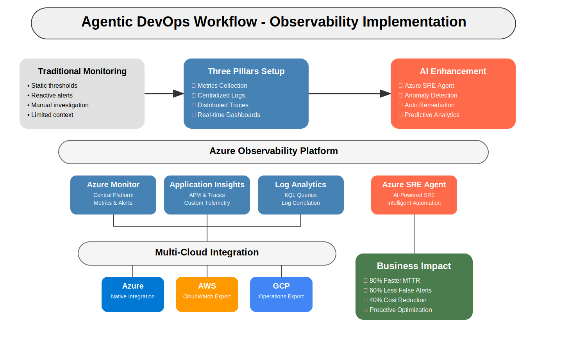

# 🚀 Agentic Operations and Observability

Welcome to the **Agentic Operations & Obervability** Workshop! This hands-on workshop guides you through implementing comprehensive observability solutions for cloud applications using Azure Monitor, Application Insights, and new AI-powered tools like Azure SRE Agent.

[](https://agentic-ops.dev)
[](https://github.com/paulasilvatech/Agentic-Ops-Dev)
[](LICENSE)

## Agentic DevOps Workflow - Observability Implementation


## 🌐 Official Workshop Website: [agentic-ops.dev](https://agentic-ops.dev)

## 📖 The Journey to AI-Enhanced Observability

Welcome to the Azure AI Ops Observability Workshop! This repository takes you on a transformative journey from traditional monitoring to the world of AI-assisted observability and agentic DevOps.

As a cloud engineer in today's distributed systems environment, you face a critical challenge: **traditional monitoring only shows you what's wrong, not why or how to fix it**. According to the observability introduction:

* Traditional monitoring approaches only catch problems you anticipated
* High alert fatigue leads to missed critical issues (false positives)
* Difficult to correlate issues across distributed microservices
* Reactive troubleshooting instead of proactive optimization

This workshop provides hands-on guidance to implement modern observability using the three pillars approach - metrics, logs, and traces - enhanced with AI capabilities. We'll demonstrate how Azure SRE Agent and other advanced tools can transform your monitoring strategy.

> "Observability is not about the data you collect, but about the questions you can answer with that data."

## ⭐ Business Impact

Organizations implementing comprehensive observability report significant benefits:

* **Faster Time to Resolution**: Reduce mean time to recovery (MTTR) from hours to minutes
* **Proactive Issue Detection**: Find problems before customers do
* **Reduced Alert Fatigue**: 80% reduction in false positives with AI-enhanced alerting
* **Cost Optimization**: Identify and eliminate waste in cloud resources
* **Team Efficiency**: Shift from 60% reactive firefighting to 70% proactive improvements

Advanced observability enables the progression through four maturity stages:
1. **Reactive**: Basic monitoring and alerting
2. **Proactive**: Trend analysis and capacity planning
3. **Predictive**: Anomaly detection and forecasting
4. **Autonomous**: Self-healing and optimization



## 📋 Workshop Structure

The workshop is organized into progressive modules, allowing you to choose the depth of coverage based on your time and experience:

| Level | Duration | Focus | Best For |
|-------|----------|-------|----------|
| **Essential** | 2 hours | Core concepts and setup | Beginners, time-constrained sessions |
| **Standard** | 4 hours | Complete implementation | Intermediate users, standard workshops |
| **Advanced** | 8+ hours | Enterprise-scale solutions | Experienced practitioners, deep dives |

## 🗺️ Learning Path

### 1️⃣ [Introduction to Observability](./docs/observability_introduction.md#-what-is-observability)
- [Foundation concepts and technologies](./docs/observability_introduction.md#-what-is-observability)
- [The three pillars: Metrics, Logs, and Traces](./docs/observability_introduction.md#️-the-three-pillars-of-observability)
- [Azure observability ecosystem overview](./docs/observability_introduction.md#️-azure-observability-ecosystem)

### 2️⃣ [Beginning Your Observability Journey](./docs/observability_workshop_part-01.md#-pre-workshop-preparation)
- [Workshop preparation and account setup](./docs/observability_workshop_part-01.md#-step-1-create-required-accounts)
- [Creating your first monitoring solution](./docs/observability_workshop_part-01.md#-module-1-setting-up-your-first-monitoring-solution-30-minutes)
- [Exploring Azure Monitor fundamentals](./docs/observability_workshop_part-01.md#-beginner-workshop-2-hours)

### 3️⃣ [Building Dashboards and Alerts](./docs/observability_workshop_part-02.md#-module-2-creating-your-first-dashboard-and-alerts-25-minutes)
- [Creating custom dashboards](./docs/observability_workshop_part-02.md#-21-build-custom-dashboard-in-azure-portal)
- [Setting up intelligent alerts](./docs/observability_workshop_part-02.md#-module-2-creating-your-first-dashboard-and-alerts-25-minutes)
- [Using GitHub Copilot for monitoring queries](./docs/observability_workshop_part-02.md#-module-2-creating-your-first-dashboard-and-alerts-25-minutes)

### 4️⃣ [Advanced Application Insights](./docs/observability_workshop_part-03.md#-module-1-advanced-application-insights-and-distributed-tracing-60-minutes)
- [Distributed tracing across microservices](./docs/observability_workshop_part-03.md#️-11-microservices-architecture-setup)
- [Custom telemetry and business metrics](./docs/observability_workshop_part-03.md#-module-1-advanced-application-insights-and-distributed-tracing-60-minutes)
- [Advanced performance monitoring](./docs/observability_workshop_part-03.md#-module-1-advanced-application-insights-and-distributed-tracing-60-minutes)

### 5️⃣ [Multi-Cloud Integration](./docs/observability_workshop_part-04.md)
- Monitoring across Azure, AWS, and GCP
- Centralized observability platform
- Cross-cloud correlation and insights

### 6️⃣ [AI-Enhanced Monitoring](./docs/observability_workshop_part-05.md)
- Azure SRE Agent implementation
- Intelligent incident detection and response
- Predictive analytics and anomaly detection

### 7️⃣ [Enterprise Implementation](./docs/observability_workshop_part-06.md)
- Scalable observability architecture
- Governance and compliance monitoring
- Cost optimization strategies

### 8️⃣ [Hands-On Challenge Labs](./docs/observability_workshop_part-07.md)
- Real-world troubleshooting scenarios
- End-to-end implementation exercises
- Performance optimization tasks

### 🧩 [Troubleshooting Guide](./docs/observability_troubleshooting_guide.md#️-prerequisites-and-setup-issues)
- [Common issues and solutions](./docs/observability_troubleshooting_guide.md#-issue-azure-cli-authentication-failures)
- [Advanced debugging techniques](./docs/observability_troubleshooting_guide.md#️-prerequisites-and-setup-issues)
- [Performance optimization strategies](./docs/observability_troubleshooting_guide.md#️-prerequisites-and-setup-issues)

## 🔑 Prerequisites

### Required Accounts
- Create [Azure Free Account](https://go.microsoft.com/fwlink/?linkid=859151)
- GitHub account with [GitHub Copilot Free](https://code.visualstudio.com/docs/copilot/setup-simplified)
- Access to [Azure SRE Agent preview](https://microsoft.qualtrics.com/jfe/form/SV_cw3LUvdoaJ0SdcW)
- Download [VS Code](https://visualstudio.microsoft.com/downloads/)

### Technical Requirements
- Development environment: VS Code, Azure CLI, Git
- Basic understanding of cloud services
- Familiarity with Azure fundamentals

## 🛠️ Getting Started

1. **Fork and Clone this Repository**
   ```bash
   git clone https://github.com/YourUsername/Agentic-Ops-Dev.git
   cd Agentic-Ops-Dev
   ```
   
2. **Register for Workshop Access**
   - Visit [https://agentic-ops.dev](https://agentic-ops.dev) to register
   - Complete the Azure SRE Agent preview registration

3. **Follow the Workshop Structure**
   - Start with [Introduction to Observability](./docs/observability_introduction.md)
   - Progress through the modules based on your experience level
   - Use the [Troubleshooting Guide](./docs/observability_troubleshooting_guide.md) if needed

## 🌟 Key Features

- **AI-Enhanced Monitoring**: Learn to implement Azure SRE Agent for intelligent observability
- **Multi-Cloud Coverage**: Build unified monitoring across Azure, AWS, and GCP
- **Real-World Scenarios**: Practice with authentic production-like challenges
- **Progressive Learning**: Start from basics and advance to enterprise-scale solutions
- **GitHub Copilot Integration**: Use AI to write monitoring queries and troubleshoot issues

## 🔗 Related Repositories

### [Design-to-Code](https://github.com/paulasilvatech/Design-to-Code-Dev)
A comprehensive guide for transforming Figma designs into production-ready code. This playbook provides a structured approach to converting design assets into high-quality, accessible, and maintainable code with practical workflows, code examples, and hands-on exercises using modern tools like VS Code, GitHub Copilot, and Azure AI.

### [AI Code Development](https://github.com/paulasilvatech/Code-AI-Dev)
A complete guide for leveraging AI tools like GitHub Copilot to optimize and improve code quality in enterprise environments. This repository covers advanced AI-assisted workflows, refactoring techniques, code optimization strategies, and best practices for integrating AI tools into your development process.

### [Agentic Operations & Observability](https://github.com/paulasilvatech/Agentic-Ops-Dev)
A hands-on workshop for implementing comprehensive observability solutions for cloud applications using Azure Monitor, Application Insights, and AI-powered tools like Azure SRE Agent. This repository guides you through the journey from traditional monitoring to AI-enhanced observability, covering the three pillars (metrics, logs, traces), multi-cloud integration, and agentic DevOps practices.

## 👤 Credits

This Azure AI Ops Observability Workshop was developed by [Paula Silva](https://github.com/paulanunes85), Developer Productivity [Global Black Belt at Microsoft Americas](https://www.linkedin.com/in/paulanunes/). The workshop provides a comprehensive approach to implementing AI-enhanced observability solutions for modern cloud applications.
