# 🔍 Azure Observability Workshop - Introduction to Concepts and Technologies

## 🌟 Welcome to Modern Observability

In today's complex, distributed, and cloud-native world, understanding what's happening inside your applications and infrastructure is more critical than ever. This introduction will guide you through the fundamental concepts, technologies, and practices that form the foundation of modern observability.

---

## 📖 Table of Contents

1. [What is Observability?](#what-is-observability)
2. [The Three Pillars of Observability](#the-three-pillars-of-observability)
3. [Observability vs. Monitoring vs. Logging](#observability-vs-monitoring-vs-logging)
4. [Key Technologies and Tools](#key-technologies-and-tools)
5. [Azure Observability Ecosystem](#azure-observability-ecosystem)
6. [Modern Observability Patterns](#modern-observability-patterns)
7. [Site Reliability Engineering (SRE) and Observability](#site-reliability-engineering-sre-and-observability)
8. [AI and Machine Learning in Observability](#ai-and-machine-learning-in-observability)
9. [Multi-Cloud and Hybrid Observability](#multi-cloud-and-hybrid-observability)
10. [Getting Started: Your Observability Journey](#getting-started-your-observability-journey)

---

## 🎯 What is Observability?

### 📖 Definition
**Observability** is the ability to understand the internal state of a system by examining its external outputs. In software systems, it's the practice of collecting, processing, and analyzing data about your applications and infrastructure to understand their behavior, performance, and health.

### 💡 Core Concept
> *"Observability is not about the data you collect, but about the questions you can answer with that data."*

Unlike traditional monitoring, which tells you *what* is wrong, observability helps you understand *why* something is wrong and *how* to fix it.

### 🚀 Why Observability Matters

#### 🏗️ **Modern System Complexity**
- **Microservices Architecture**: Applications are distributed across dozens or hundreds of services
- **Cloud-Native Deployments**: Infrastructure is dynamic, ephemeral, and auto-scaling
- **Polyglot Environments**: Multiple languages, frameworks, and technologies
- **Multi-Cloud Strategies**: Services running across different cloud providers

#### 🚀 **Business Impact**
- **Faster Time to Resolution**: Reduce mean time to recovery (MTTR) from hours to minutes
- **Proactive Issue Detection**: Find problems before customers do
- **Performance Optimization**: Understand and improve user experience
- **Cost Optimization**: Identify and eliminate waste in cloud resources

#### 👥 **Team Efficiency**
- **Reduced Alert Fatigue**: Smart, contextual alerting instead of noise
- **Collaborative Debugging**: Shared understanding across development and operations
- **Data-Driven Decisions**: Use real data to guide architectural and business decisions
- **Continuous Improvement**: Learn from failures and optimize systems continuously

---

## 🏛️ The Three Pillars of Observability

Modern observability is built on three fundamental data types, often called the "three pillars":

```mermaid
graph TB
    A[🔍 Complete Observability] --> B[📊 Metrics]
    A --> C[📝 Logs] 
    A --> D[🔗 Traces]
    
    B --> B1[Time-series Data]
    B --> B2[Performance KPIs]
    B --> B3[Resource Utilization]
    B --> B4[Business Metrics]
    
    C --> C1[Event Records]
    C --> C2[Error Details]
    C --> C3[Audit Trails]
    C --> C4[Debug Information]
    
    D --> D1[Request Flows]
    D --> D2[Service Dependencies]
    D --> D3[Latency Analysis]
    D --> D4[Error Attribution]
    
    B1 --> E[📈 Dashboards & Alerts]
    C1 --> E
    D1 --> E
    
    B2 --> F[🔍 Root Cause Analysis]
    C2 --> F
    D2 --> F
    
    B3 --> G[🎯 Performance Optimization]
    C3 --> G
    D3 --> G
    
    style A fill:#e1f5fe
    style B fill:#fff3e0
    style C fill:#f3e5f5
    style D fill:#e8f5e8
    style E fill:#fce4ec
    style F fill:#fff8e1
    style G fill:#e0f2f1
```



### 1. 📊 Metrics (What happened?)

**Definition**: Numerical measurements of your system's behavior over time.

**Characteristics**:
- **Time-series data**: Values with timestamps
- **Aggregatable**: Can be summed, averaged, or percentiled
- **Low storage cost**: Efficient to store and query
- **Real-time**: Near-instantaneous collection and alerting

**📊 Metric Examples:**
```bash
# System Performance Metrics
CPU_UTILIZATION=75%                    # Current processor usage
MEMORY_USAGE=2.3GB                     # Active memory consumption
DISK_USAGE=85%                         # Storage capacity utilization

# Application Performance Metrics  
REQUEST_RATE=1247/sec                  # Incoming requests per second
ERROR_RATE=0.03%                       # Failed requests percentage
RESPONSE_TIME_P95=245ms                # 95th percentile latency
RESPONSE_TIME_P99=890ms                # 99th percentile latency

# Business Metrics
ACTIVE_USERS=3456                      # Currently logged in users
ORDERS_PER_MINUTE=127                  # Business transaction rate
DATABASE_CONNECTIONS=45/100            # Active DB connection pool
```

**Use Cases**:
- **Performance monitoring**: Track system health and performance trends
- **Alerting**: Trigger notifications when thresholds are exceeded
- **Capacity planning**: Understand resource utilization patterns
- **SLA monitoring**: Track service level objectives and error budgets

### 2. 📝 Logs (What exactly happened?)

**Definition**: Discrete events that occurred in your system with detailed context.

**Characteristics**:
- **Event-based**: Each log entry represents a specific occurrence
- **Rich context**: Contains detailed information about what happened
- **Searchable**: Full-text search capabilities
- **High volume**: Can generate large amounts of data

**📝 Structured Log Examples:**
```json
// INFO: Successful user authentication
{
  "timestamp": "2025-01-15T14:30:45Z",
  "level": "INFO",
  "service": "UserService",
  "operation": "user_login",
  "message": "User login successful",
  "context": {
    "userId": "12345",
    "ip": "192.168.1.100",
    "userAgent": "Mozilla/5.0...",
    "sessionId": "sess_abc123"
  }
}

// ERROR: Database connectivity issue
{
  "timestamp": "2025-01-15T14:30:47Z",
  "level": "ERROR", 
  "service": "OrderService",
  "operation": "database_connect",
  "message": "Database connection failed: timeout after 30s",
  "context": {
    "database": "orders_db",
    "timeout": "30s",
    "connectionPool": "pool_1",
    "retryAttempt": 1
  }
}

// WARN: Retry mechanism in action
{
  "timestamp": "2025-01-15T14:30:48Z",
  "level": "WARN",
  "service": "PaymentService", 
  "operation": "payment_processing",
  "message": "Retry attempt 2/3 for payment processing",
  "context": {
    "paymentId": "pay_xyz789",
    "retryCount": 2,
    "maxRetries": 3,
    "lastError": "gateway_timeout"
  }
}
```

**Use Cases**:
- **Debugging**: Understand the sequence of events leading to an issue
- **Audit trails**: Track user actions and system changes
- **Root cause analysis**: Investigate specific incidents in detail
- **Compliance**: Maintain records for regulatory requirements

### 3. 🔗 Traces (How did it happen?)

**Definition**: Records of requests as they flow through your distributed system.

**Characteristics**:
- **Request-scoped**: Follows a single request across multiple services
- **Causal relationships**: Shows parent-child relationships between operations
- **Timing information**: Measures latency at each step
- **Context propagation**: Carries metadata across service boundaries

**🔗 Distributed Trace Example:**
```yaml
# Complete request flow with timing and context
Trace ID: abc123def456
Span Duration: 847ms total

┌─ Span 1: web-frontend (120ms)
│  ├─ Operation: handle_user_request  
│  ├─ Tags: {http.method: POST, user.id: 12345}
│  └─ Children: user-service, order-service
│
├─ Span 2: user-service (45ms) 
│  ├─ Operation: validate_user_session
│  ├─ Tags: {user.id: 12345, session.valid: true}
│  └─ Children: database-query
│
├─ Span 3: database-query (25ms)
│  ├─ Operation: SELECT user FROM users WHERE id=?
│  └─ Tags: {db.statement: "SELECT...", db.rows: 1}
│
├─ Span 4: order-service (450ms)
│  ├─ Operation: process_order
│  ├─ Tags: {order.id: ord_789, order.total: 99.99}
│  └─ Children: payment-service, inventory-service
│
├─ Span 5: payment-service (380ms)
│  ├─ Operation: charge_payment_method
│  ├─ Tags: {payment.gateway: stripe, payment.status: success}
│  └─ Children: external-api-call
│
├─ Span 6: external-api-call (350ms)
│  ├─ Operation: POST /v1/charges
│  └─ Tags: {http.status_code: 200, external.service: stripe}
│
└─ Span 7: inventory-service (120ms)
   ├─ Operation: update_stock_quantity
   ├─ Tags: {product.id: ABC123, quantity.before: 50, quantity.after: 49}
   └─ Children: cache-update

# Key Insights from this trace:
# - Payment service is the bottleneck (380ms of 847ms total)
# - External API call represents 80% of payment service time  
# - User validation is fast and efficient (45ms)
# - Database queries are well-optimized (25ms)
```

**Use Cases**:
- **Performance optimization**: Identify bottlenecks in request processing
- **Service dependency mapping**: Understand how services interact
- **Error attribution**: Determine which service caused a failure
- **Latency analysis**: Break down response times by component

---

## ⚖️ Observability vs. Monitoring vs. Logging

Understanding the differences between these approaches is crucial for implementing effective observability strategies.

| Aspect | 📊 Traditional Monitoring | 📝 Modern Logging | 🔍 Modern Observability |
|--------|---------------------------|-------------------|-------------------------|
| **🎯 Focus** | Predefined metrics and known failure modes | Collecting and searching event data | Understanding system behavior through comprehensive data |
| **🔍 Approach** | "Known unknowns" - monitoring what you expect to break | Reactive debugging and forensic analysis | "Unknown unknowns" - discovering what you didn't know could break |
| **🛠️ Primary Tools** | Nagios, Zabbix, SCOM | ELK Stack, Splunk, Fluentd | Azure Monitor, Datadog, New Relic, Honeycomb |
| **✅ Best Use Cases** | Infrastructure monitoring, basic health checks | Detailed investigation, audit trails, compliance | Complex distributed systems, proactive detection |
| **⚡ Response Type** | Reactive alerts | Reactive investigation | Proactive insights |
| **📊 Data Types** | Simple metrics | Event logs | Metrics, logs, traces, and correlations |

### 📊 Traditional Monitoring Examples
```bash
# Basic threshold alerts
CPU_USAGE > 80% → ALERT
DISK_SPACE < 10% → ALERT  
SERVICE_STATUS = DOWN → ALERT
RESPONSE_TIME > 2000ms → ALERT
```

**⚠️ Limitations:**
- Only catches anticipated problems
- Limited troubleshooting context
- High false positive rates
- Poor correlation across systems

### 📝 Modern Logging Examples
```json
{
  "timestamp": "2025-01-15T14:30:45Z",
  "level": "ERROR",
  "service": "OrderService",
  "message": "Database connection failed",
  "context": {
    "userId": "12345",
    "orderId": "ABC123",
    "timeout": "30s"
  }
}
```

**⚠️ Limitations:**
- Requires knowing what to search for
- Expensive at scale
- Difficult cross-system correlation
- Primarily reactive approach

### 🔍 Modern Observability Examples
```yaml
# Intelligent correlation and insights
Automated Discovery:
  - Service topology mapping
  - Dependency relationship detection
  - Performance baseline establishment

Dynamic Alerting:
  - Anomaly detection algorithms
  - Context-aware notifications
  - Predictive failure analysis

Cross-Signal Correlation:
  - Metric + Log + Trace analysis
  - Business impact assessment
  - Root cause identification
```

**✅ Advantages:**
- Discovers unexpected failure modes
- Rich troubleshooting context
- Proactive optimization capabilities
- Scales with system complexity

---

## 🛠️ Key Technologies and Tools

### 🌐 Open Source Ecosystem

#### 📊 **Prometheus & Grafana**
- **Prometheus**: Time-series database and monitoring system
- **Grafana**: Visualization and dashboarding platform
- **Use Case**: Infrastructure and application metrics monitoring

```yaml
Example Prometheus Query:
# HTTP request rate by service
rate(http_requests_total[5m])

# 95th percentile response time
histogram_quantile(0.95, http_request_duration_seconds_bucket)
```

#### 🔍 **Jaeger & Zipkin**
- **Jaeger**: Distributed tracing system (CNCF project)
- **Zipkin**: Distributed tracing system (originated at Twitter)
- **Use Case**: Request tracing across microservices

```yaml
Example Trace Span:
{
  "traceID": "abc123",
  "spanID": "def456", 
  "operationName": "user-login",
  "startTime": "2025-01-15T14:30:45Z",
  "duration": "245ms",
  "tags": {
    "http.method": "POST",
    "user.id": "12345"
  }
}
```

#### 📝 **ELK Stack (Elasticsearch, Logstash, Kibana)**
- **Elasticsearch**: Search and analytics engine
- **Logstash**: Log processing pipeline
- **Kibana**: Data visualization platform
- **Use Case**: Centralized logging and log analytics

#### 🌐 **OpenTelemetry**
- **Purpose**: Vendor-neutral observability framework
- **Components**: APIs, SDKs, and tools for collecting telemetry
- **Benefit**: Standardized instrumentation across languages and vendors

```python
# OpenTelemetry Python Example
from opentelemetry import trace
from opentelemetry.exporter.azure.monitor import AzureMonitorTraceExporter

tracer = trace.get_tracer(__name__)

with tracer.start_as_current_span("user-service-call") as span:
    span.set_attribute("user.id", user_id)
    result = process_user_request(user_id)
    span.set_attribute("result.status", "success")
```

### 🏢 Commercial Solutions

#### ☁️ **Cloud-Native Platforms**
- **Azure Monitor**: Microsoft's comprehensive observability platform
- **AWS CloudWatch**: Amazon's monitoring and observability service  
- **Google Cloud Operations**: Google's observability suite
- **Use Case**: Cloud-native applications with deep platform integration

#### 🏢 **Enterprise APM Solutions**
- **Datadog**: Full-stack monitoring platform
- **New Relic**: Application performance monitoring
- **Dynatrace**: AI-powered observability platform
- **Use Case**: Enterprise environments requiring advanced analytics and AI

---

## ☁️ Azure Observability Ecosystem

### 🏗️ Complete Observability Data Flow


---

Microsoft Azure provides a comprehensive set of observability services that work together to provide end-to-end visibility into your applications and infrastructure.

### 📊 Core Azure Monitor Services

#### 🔧 **Azure Monitor**
**Purpose**: Central hub for all monitoring data in Azure
**Capabilities**:
- Metrics collection and storage
- Log analytics and querying
- Alerting and notifications
- Workbooks and dashboards

```kusto
// 📊 Azure Monitor KQL Query - Request Analysis
// Purpose: Analyze API request patterns and performance over the last hour

requests                                    // Query the requests table
| where timestamp > ago(1h)                // Filter to last 1 hour of data
| summarize                                 // Aggregate the results
    RequestCount = count(),                 // Total number of requests
    AvgDuration = avg(duration),           // Average response time in ms
    MaxDuration = max(duration),           // Slowest request in ms  
    P95Duration = percentile(duration, 95), // 95th percentile latency
    ErrorRate = (countif(success == false) * 100.0) / count() // Error percentage
  by name                                   // Group by operation name
| order by RequestCount desc               // Sort by most frequent operations
| take 20                                  // Limit to top 20 results

// 💡 Copy this query to Azure Monitor Log Analytics to run
// 🔍 Expected output: Table showing top API operations with performance metrics
```

#### 📱 **Application Insights**
**Purpose**: Application Performance Monitoring (APM) for web applications
**Capabilities**:
- Automatic instrumentation for popular frameworks
- Custom telemetry collection
- Real-time performance monitoring
- Dependency tracking and application maps

```csharp
// 🔧 Application Insights Integration - Order Processing Controller
// Purpose: Comprehensive telemetry collection for e-commerce order creation

using Microsoft.ApplicationInsights;
using Microsoft.ApplicationInsights.DataContracts;

[ApiController]
[Route("api/[controller]")]
public class OrderController : Controller
{
    private readonly TelemetryClient _telemetryClient;
    private readonly IOrderService _orderService;
    private readonly ILogger<OrderController> _logger;
    
    public OrderController(
        TelemetryClient telemetryClient, 
        IOrderService orderService,
        ILogger<OrderController> logger)
    {
        _telemetryClient = telemetryClient;
        _orderService = orderService;
        _logger = logger;
    }
    
    [HttpPost]
    public async Task<IActionResult> CreateOrder([FromBody] Order order)
    {
        // 🔍 Start distributed tracing operation
        using var operation = _telemetryClient.StartOperation<RequestTelemetry>("CreateOrder");
        operation.Telemetry.Properties["UserId"] = order.UserId.ToString();
        operation.Telemetry.Properties["OrderValue"] = order.TotalAmount.ToString("C");
        
        var stopwatch = Stopwatch.StartNew();
        
        try
        {
            // 📊 Track custom metric for order attempts
            _telemetryClient.TrackMetric("Order.Attempts", 1, 
                new Dictionary<string, string> 
                {
                    {"PaymentMethod", order.PaymentMethod},
                    {"CustomerType", order.CustomerType}
                });
            
            // 🏗️ Process the order with automatic dependency tracking
            var result = await _orderService.ProcessOrder(order);
            stopwatch.Stop();
            
            // ✅ Track successful order creation event
            _telemetryClient.TrackEvent("OrderCreated", 
                properties: new Dictionary<string, string> 
                {
                    {"OrderId", result.Id},
                    {"UserId", order.UserId.ToString()},
                    {"ProductCount", order.Items.Count.ToString()},
                    {"PaymentMethod", order.PaymentMethod}
                },
                metrics: new Dictionary<string, double>
                {
                    {"OrderValue", (double)order.TotalAmount},
                    {"ProcessingTimeMs", stopwatch.ElapsedMilliseconds}
                });
            
            // 📈 Track business KPI
            _telemetryClient.TrackMetric("Revenue.OrderValue", (double)order.TotalAmount);
            
            _logger.LogInformation("Order {OrderId} created successfully for user {UserId}", 
                result.Id, order.UserId);
                
            return Ok(result);
        }
        catch (ValidationException ex)
        {
            // ⚠️ Track validation errors separately
            _telemetryClient.TrackException(ex, 
                new Dictionary<string, string>
                {
                    {"ErrorType", "Validation"},
                    {"UserId", order.UserId.ToString()},
                    {"ValidationErrors", string.Join(", ", ex.Errors)}
                });
                
            return BadRequest(ex.Message);
        }
        catch (Exception ex)
        {
            // 🚨 Track unexpected errors with full context
            _telemetryClient.TrackException(ex,
                new Dictionary<string, string>
                {
                    {"ErrorType", "Unexpected"},
                    {"UserId", order.UserId.ToString()},
                    {"OrderData", JsonSerializer.Serialize(order)}
                });
                
            _logger.LogError(ex, "Failed to create order for user {UserId}", order.UserId);
            return StatusCode(500, "An error occurred while processing your order");
        }
    }
}

// 💡 Key Telemetry Features:
// - Distributed tracing with StartOperation
// - Custom events with properties and metrics  
// - Business KPI tracking (revenue, conversion rates)
// - Exception handling with context
// - Performance measurement
// - Structured logging integration
```

#### 📊 **Container Insights**
**Purpose**: Monitoring for Azure Kubernetes Service (AKS) and containers
**Capabilities**:
- Node and pod performance monitoring
- Container logs collection
- Kubernetes cluster health monitoring
- Resource utilization tracking

#### 🔐 **Microsoft Sentinel**
**Purpose**: Cloud-native Security Information and Event Management (SIEM)
**Capabilities**:
- Security analytics and threat detection
- Incident investigation and response
- Compliance monitoring and reporting
- Integration with Azure security services

### 🚀 Advanced Azure Observability Features

#### 🤖 **Azure SRE Agent (Preview)**
**Purpose**: AI-powered Site Reliability Engineering automation
**Capabilities**:
- Intelligent incident detection and response
- Automated remediation actions
- Predictive analytics and anomaly detection
- Integration with development workflows

#### 📈 **Azure Metrics Advisor**
**Purpose**: AI-powered anomaly detection for business metrics
**Capabilities**:
- Automatic anomaly detection
- Root cause analysis
- Business intelligence integration
- Custom metric monitoring

#### 🔍 **Azure Service Map**
**Purpose**: Automatic discovery and mapping of application dependencies
**Capabilities**:
- Real-time service topology
- Performance impact analysis
- Change tracking and correlation
- Integration with Application Insights

---

## 🔄 Modern Observability Patterns

### 1. **Shift-Left Observability**
**Concept**: Integrate observability into the development process from the beginning

**Implementation**:
- Observability requirements in user stories
- Telemetry-driven development (TDD)
- Local observability testing
- Observability code reviews

```yaml
# Example: Observability User Story
As a developer
I want to track user login success/failure rates
So that I can quickly identify authentication issues

Acceptance Criteria:
- Custom metric tracks login attempts and outcomes
- Dashboard shows login success rate over time
- Alert triggers when success rate drops below 95%
```

### 2. **Observability as Code**
**Concept**: Manage observability configuration using infrastructure as code principles

**Implementation**:
```yaml
# Terraform Example: Application Insights Alert
resource "azurerm_monitor_metric_alert" "high_response_time" {
  name                = "high-response-time-alert"
  resource_group_name = azurerm_resource_group.main.name
  scopes              = [azurerm_application_insights.main.id]
  description         = "Alert when average response time exceeds 2 seconds"
  
  criteria {
    metric_namespace = "Microsoft.Insights/components"
    metric_name      = "requests/duration"
    aggregation      = "Average"
    operator         = "GreaterThan"
    threshold        = 2000
  }
  
  action {
    action_group_id = azurerm_monitor_action_group.main.id
  }
}
```

### 3. **Progressive Observability**
**Concept**: Gradually increase observability maturity as systems and teams evolve

**Stages**:
1. **Reactive**: Basic monitoring and alerting
2. **Proactive**: Trend analysis and capacity planning
3. **Predictive**: Anomaly detection and forecasting
4. **Autonomous**: Self-healing and optimization

### 4. **Observability-Driven Development**
**Concept**: Use observability data to guide development and architectural decisions

**Practices**:
- Feature flag telemetry
- A/B testing measurement
- Performance budgets
- Error budget tracking

---

## 🎯 Site Reliability Engineering (SRE) and Observability

### 📊 SRE Principles
**Site Reliability Engineering** is a discipline that applies software engineering approaches to infrastructure and operations problems.

#### Key SRE Concepts:

##### 🎯 **Service Level Objectives (SLOs)**
Quantitative measures of service reliability

```yaml
Example SLO:
- Availability: 99.9% uptime over 30 days
- Latency: 95% of requests complete within 200ms
- Throughput: Handle 10,000 requests per second
- Error Rate: Less than 0.1% of requests result in errors
```

##### 📊 **Service Level Indicators (SLIs)**
Metrics that measure SLO compliance

```kusto
// 🎯 SLI Calculation - Service Availability Measurement
// Purpose: Calculate availability SLI over 30-day rolling window for SLO compliance

requests                                          // Query application requests table
| where timestamp > ago(30d)                     // Last 30 days of data
| where name !has "healthcheck"                  // Exclude health check endpoints
| summarize 
    TotalRequests = count(),                      // Count all requests
    SuccessfulRequests = countif(success == true), // Count successful requests (HTTP 2xx)
    FailedRequests = countif(success == false),   // Count failed requests
    ServerErrorRequests = countif(resultCode >= 500), // Count 5xx errors
    ClientErrorRequests = countif(resultCode >= 400 and resultCode < 500) // Count 4xx errors
| extend 
    AvailabilityPercentage = round((SuccessfulRequests * 100.0) / TotalRequests, 3), // Calculate availability
    ErrorRate = round((FailedRequests * 100.0) / TotalRequests, 3),                  // Calculate error rate
    ServerErrorRate = round((ServerErrorRequests * 100.0) / TotalRequests, 3)        // Server error rate
| project 
    TimeWindow = "Last 30 Days",
    TotalRequests,
    SuccessfulRequests, 
    AvailabilityPercentage,
    ErrorRate,
    ServerErrorRate,
    SLOTarget = 99.9,                             // Target SLO: 99.9% availability
    SLOCompliance = iff(AvailabilityPercentage >= 99.9, "✅ Meeting SLO", "❌ Below SLO")

// 💡 Expected Results:
// - Availability: 99.95% (above 99.9% target)
// - Error Rate: 0.05% (within acceptable limits)  
// - SLO Status: Meeting target
// 
// 📊 Copy to Azure Monitor to track your SLIs
```

##### ⚖️ **Error Budgets**
Allowable amount of unreliability within SLO targets

```yaml
Error Budget Calculation:
- SLO: 99.9% availability
- Error Budget: 0.1% = 43.2 minutes downtime per 30 days
- Current Usage: 15 minutes (34.7% of budget consumed)
```

### 🔄 SRE Observability Practices

#### 🚨 **Smart Alerting**
Alerts should be actionable, meaningful, and urgent

```yaml
Good Alert:
- Signal: 95th percentile latency > 500ms for 5 minutes
- Action: Investigate performance degradation
- Urgency: Affects user experience, requires immediate attention

Bad Alert:
- Signal: CPU > 80% for 1 minute
- Problem: May not indicate user impact, too sensitive
```

#### 🔄 **Incident Response Integration**
Observability tools should integrate with incident management

```yaml
Incident Response Flow:
1. Alert Detection → 2. Auto-Assignment → 3. Context Gathering → 4. Remediation → 5. Postmortem
```

#### 📚 **Postmortem Culture**
Use observability data to learn from failures

```yaml
Postmortem Template:
- Incident Summary: What happened and impact
- Timeline: Sequence of events with observability data
- Root Cause: Why it happened (not who)
- Action Items: Improvements to prevent recurrence
```

---

## 🤖 AI and Machine Learning in Observability

### 🚨 Intelligent Alerting
**Traditional Alerting**: Static thresholds and rule-based systems
**AI-Enhanced Alerting**: Dynamic baselines and anomaly detection

```yaml
Traditional:
- Alert if response time > 2 seconds

AI-Enhanced:
- Alert if response time deviates significantly from historical patterns
- Consider time of day, day of week, seasonal trends
- Reduce false positives by 80%
```

### 🔮 Predictive Analytics
**Capabilities**:
- Capacity planning and resource forecasting
- Failure prediction before impact
- Performance trend analysis
- Automated scaling recommendations

```python
# Example: Predictive Scaling with Azure ML
from azure.ai.ml import MLClient
from azure.ai.ml.entities import Model

# Load trained model for resource prediction
model = ml_client.models.get("resource-prediction-model", version="latest")

# Predict resource needs for next hour
prediction = model.predict(current_metrics)

if prediction.cpu_usage > 80:
    trigger_scale_out_event()
```

### 🤖 Automated Remediation
**AI-Driven Actions**:
- Automatic service restarts for known issues
- Dynamic resource allocation
- Traffic routing optimization
- Configuration adjustments

### 🕵️ Root Cause Analysis
**AI Assistance**:
- Correlation analysis across multiple data sources
- Pattern recognition from historical incidents
- Suggested investigation paths
- Automated impact assessment

---

## 🌐 Multi-Cloud and Hybrid Observability

### ⚠️ Challenges in Multi-Cloud Environments

#### 🔗 **Data Silos**
Different cloud providers use different monitoring systems
**Solution**: Centralized observability platform that aggregates data from all clouds

#### 🌐 **Network Complexity**
Services communicate across cloud boundaries with varying latencies
**Solution**: Distributed tracing with cross-cloud correlation

#### 🔐 **Security and Compliance**
Different security models and compliance requirements across clouds
**Solution**: Unified security monitoring and audit trails

#### 💰 **Cost Management**
Complex billing and resource optimization across providers
**Solution**: Multi-cloud cost monitoring and optimization

### 🛠️ Multi-Cloud Observability Strategies

#### 🎯 **Hub and Spoke Model**
Choose one cloud as the central observability hub

```yaml
Architecture:
Central Hub (Azure):
- Azure Monitor as primary platform
- Centralized dashboards and alerting
- Data aggregation from all clouds

Spoke Clouds (AWS, GCP):
- Local data collection agents
- Stream data to central hub
- Local emergency monitoring
```

#### 🔄 **Federation Model**
Federate data between cloud-native monitoring systems

```yaml
Implementation:
- Prometheus federation across clouds
- Cross-cloud Grafana dashboards
- Distributed Jaeger tracing
- Unified alert management
```

#### 🏢 **Third-Party Unified Platform**
Use vendor solutions that natively support multi-cloud

```yaml
Examples:
- Datadog: Native multi-cloud support
- New Relic: Cloud-agnostic monitoring
- Dynatrace: AI-powered multi-cloud observability
```

---

## 🚀 Getting Started: Your Observability Journey

### 📊 Assessment: Where Are You Now?

#### 🔍 **Level 1: Basic Monitoring**
**Characteristics**:
- Simple uptime checks and basic metrics
- Manual log searching
- Reactive alerting
- Limited visibility into application performance

**Next Steps**: Implement centralized logging and basic APM

#### 📊 **Level 2: Comprehensive Monitoring**
**Characteristics**:
- Structured logging and metrics collection
- Basic application performance monitoring
- Some automation in alerting
- Service-level dashboards

**Next Steps**: Add distributed tracing and custom business metrics

#### 🎯 **Level 3: Full Observability**
**Characteristics**:
- Metrics, logs, and traces integrated
- Custom telemetry for business KPIs
- Proactive alerting and anomaly detection
- Good incident response processes

**Next Steps**: Implement SRE practices and AI-enhanced monitoring

#### 🚀 **Level 4: Observability Excellence**
**Characteristics**:
- AI-powered insights and automation
- Predictive analytics and self-healing systems
- Full integration with development processes
- Continuous optimization and learning

**Next Steps**: Share knowledge and mentor other teams

### 🗺️ Implementation Roadmap

#### 🗓️ **Phase 1: Foundation (Weeks 1-4)**
1. **Set up centralized monitoring platform** (Azure Monitor, Log Analytics)
2. **Implement basic application instrumentation** (Application Insights)
3. **Create fundamental dashboards** and alerting rules
4. **Establish incident response procedures**

#### 🗓️ **Phase 2: Enhancement (Weeks 5-12)**
1. **Add distributed tracing** across microservices
2. **Implement custom metrics** for business KPIs
3. **Create comprehensive dashboards** for different audiences
4. **Integrate monitoring with CI/CD** pipelines

#### 🗓️ **Phase 3: Optimization (Weeks 13-24)**
1. **Implement SRE practices** (SLOs, error budgets)
2. **Add intelligent alerting** and anomaly detection
3. **Automate common remediation** actions
4. **Optimize cost and performance** based on observability data

#### 🗓️ **Phase 4: Excellence (Ongoing)**
1. **Continuous improvement** of observability practices
2. **Knowledge sharing** and team education
3. **Innovation adoption** (AI, machine learning)
4. **Industry best practice** implementation

### ✅ Best Practices for Getting Started

#### 🎯 **Start Small, Think Big**
- Begin with critical applications and services
- Use pilot projects to prove value
- Scale gradually as expertise grows
- Plan for enterprise-wide adoption

#### 📊 **Focus on Value, Not Vanity Metrics**
- Measure what matters to the business
- Align metrics with user experience
- Avoid metric overload
- Regular review and refinement

#### 👥 **Build Cross-Functional Collaboration**
- Include development, operations, and business stakeholders
- Establish shared understanding of goals
- Create communication channels for observability insights
- Regular retrospectives and improvements

#### 🔄 **Embrace Continuous Learning**
- Stay current with observability trends
- Participate in community forums and conferences
- Share experiences and learn from others
- Iterate and improve practices regularly

---

## 🚀 Ready to Begin?

Congratulations! You now have a solid foundation in modern observability concepts and technologies. This knowledge will serve as your guide throughout the Azure Observability Workshop.

### ➡️ What's Next?
1. **Choose your track** based on your current skill level
2. **Set up your environment** using the prerequisites guide
3. **Join the workshop** and begin your hands-on journey
4. **Apply what you learn** in your own environments
5. **Share your success** and help others on their observability journey

### 📝 Remember:
- **Observability is a journey, not a destination**
- **Start with the basics and build complexity gradually**
- **Focus on solving real problems and providing business value**
- **Learn from failures and continuously improve**

Welcome to the world of modern observability! Let's build better, more reliable systems together. 🎉

---

## 📚 Complete Workshop Overview

### 🗺️ Workshop Learning Path Summary

| 📖 **Workshop Part** | ⏱️ **Duration** | 🎯 **Target Level** | 🛠️ **Key Technologies** | 🎓 **Learning Outcomes** |
|---|---|---|---|---|
| **Part 1**: Introduction | 30 min | All Levels | Concepts, Fundamentals | Understanding of observability principles |
| **Part 2**: Basic Setup | 2 hours | Beginner | Azure Monitor, App Insights | Functional monitoring setup |
| **Part 3**: Intermediate | 2 hours | Intermediate | Microservices, Distributed Tracing | Production-ready observability |
| **Part 4**: CI/CD & Security | 2 hours | Intermediate | GitHub Actions, Defender, Sentinel | Integrated DevSecOps monitoring |
| **Part 5**: Enterprise Scale | 2 hours | Advanced | Terraform, Kubernetes, Multi-cloud | Enterprise architecture expertise |
| **Part 6**: Service Mesh & AI | 2.5 hours | Advanced | Istio, AI-Enhanced SRE | Expert-level implementation |
| **Troubleshooting Guide** | Reference | All Levels | Debugging, Problem Resolution | Independent troubleshooting capability |
| **Workshop Structure** | Reference | Instructors | Training Delivery, Assessment | Effective workshop facilitation |

### 🎯 Skill Progression Matrix

| 🔢 **Level** | 🏷️ **Title** | 📊 **Capabilities After Completion** | 🏢 **Suitable For** |
|---|---|---|---|
| **Level 1** | **Observability Novice** | Basic monitoring setup, simple dashboards, alert creation | Individual developers, small teams |
| **Level 2** | **Monitoring Practitioner** | Distributed tracing, custom metrics, CI/CD integration | Development teams, DevOps engineers |
| **Level 3** | **Observability Engineer** | Multi-cloud integration, security monitoring, automation | Platform teams, SRE teams |
| **Level 4** | **Enterprise Architect** | AI-enhanced monitoring, compliance frameworks, mentoring | Enterprise organizations, consultants |

### ⚡ Quick Start Recommendations

| ⏰ **Available Time** | 🎯 **Recommended Path** | 🏆 **Expected Outcome** |
|---|---|---|
| **90 minutes** | Parts 1-2 (Basic Setup) | Functional monitoring for single application |
| **Half Day (4 hours)** | Parts 1-4 (Through CI/CD) | Production-ready observability with automation |
| **Full Day (8 hours)** | Parts 1-6 (Complete Workshop) | Enterprise-scale observability expertise |
| **Multi-Day** | Complete + Hands-on Practice | Mentoring capability and implementation support |

---

## 📚 Additional Resources and References

### 📝 Documentation
- [Azure Monitor Documentation](https://docs.microsoft.com/en-us/azure/azure-monitor/)
- [OpenTelemetry Specification](https://opentelemetry.io/docs/)
- [SRE Book by Google](https://sre.google/sre-book/table-of-contents/)
- [Observability Engineering (O'Reilly)](https://www.oreilly.com/library/view/observability-engineering/9781492076438/)

### 👥 Communities
- [CNCF OpenTelemetry Community](https://github.com/open-telemetry/community)
- [SRE Community](https://www.usenix.org/conferences/srecon)
- [Azure Monitor UserVoice](https://feedback.azure.com/d365community/forum/79b1327d-d925-ec11-b6e6-000d3a4f06a4)
- [Observability Slack Communities](https://observability.slack.com/)

### 🛠️ Tools and Platforms
- [Azure Monitor](https://azure.microsoft.com/en-us/services/monitor/)
- [Prometheus](https://prometheus.io/)
- [Grafana](https://grafana.com/)
- [Jaeger](https://www.jaegertracing.io/)
- [OpenTelemetry](https://opentelemetry.io/)

---

## 🔙 Navigation

**[⬅️ Back to Main README](../README.md)**
