# 🚀 Complete Azure Observability Workshop Guide - Part 1
## 🌟 From Zero to AI-Enhanced Multi-Cloud Monitoring

### 📖 Table of Contents - Complete Workshop Series

**🎯 Part 1** - Setup and Beginner Foundation (This Document)
- [Pre-Workshop Preparation](#-pre-workshop-preparation)
- [Step 1: Create Required Accounts](#-step-1-create-required-accounts)
- [Step 2: Install Required Tools](#-step-2-install-required-tools)
- [Beginner Workshop Introduction](#-beginner-workshop-2-hours)
- [Module 1: Setting Up Your First Monitoring Solution](#-module-1-setting-up-your-first-monitoring-solution-30-minutes)

**📊 Part 2** - Beginner Workshop Modules 2-5
- Module 2: Creating Your First Dashboard and Alerts
- Module 3: AI-Assisted Troubleshooting with GitHub Copilot
- Module 4: Implementing Proactive Monitoring
- Module 5: Introduction to Azure SRE Agent

**🎓 Part 3** - Intermediate Workshop (4 hours)
- Module 1: Advanced Application Insights and Distributed Tracing
- Module 2: Multi-Cloud Monitoring Integration
- Module 3: CI/CD Integration with Observability
- Module 4: Security Monitoring Integration

**🔧 Part 4** - Advanced Workshop Part 1 (3-4 hours)
- Module 1: Enterprise-Scale Observability Architecture
- Module 2: AI-Enhanced SRE Agent Implementation

**🚀 Part 5** - Advanced Workshop Part 2 (3-4 hours)
- Module 3: Infrastructure as Code with Observability
- Multi-Cloud Challenge Labs
- Final Integration and Wrap-up

---

## 🎯 Pre-Workshop Preparation

### 🎓 What You'll Learn
By completing these workshops, you will:
- **🔍 Master Azure observability fundamentals** and advanced techniques
- **🤖 Implement AI-powered monitoring** with Azure SRE Agent and GitHub Copilot
- **☁️ Deploy and monitor applications** across Azure, AWS, and Google Cloud
- **📊 Create unified dashboards** combining Azure Monitor, Datadog, and Prometheus
- **⚡ Establish automated incident response** with intelligent agents
- **🏢 Build enterprise-scale observability solutions**
- **🔐 Integrate security monitoring** with Microsoft Defender and Sentinel

### 🌟 Workshop Overview and AI-Enhanced Features

#### 🔍 What is Modern Observability?
| **📊 Traditional Monitoring** | **🔍 Modern Observability** | **🤖 AI-Enhanced Observability** |
|------------------------------|------------------------------|----------------------------------|
| Reactive alerts when something breaks | Proactive insights into system behavior through metrics, logs, and traces | Intelligent agents that monitor, analyze, predict, and respond automatically |

#### 🛠️ Key Technologies We'll Use
- **🤖 Azure SRE Agent**: NEW AI-powered site reliability engineering (BUILD 2025 launch)
- **👨‍💻 GitHub Copilot**: AI pair programmer for monitoring queries and troubleshooting
- **🧠 Azure AI Foundry**: Advanced AI analysis for code and infrastructure
- **🌐 Multi-Cloud Integration**: Azure Monitor as central hub for AWS and GCP telemetry
- **🤖 Agentic DevOps**: Where AI agents work as team members in development lifecycle

### ⏰ Time Investment
| **📚 Workshop Track** | **⏱️ Duration** | **🎯 Target Audience** |
|----------------------|----------------|----------------------|
| **🎯 Preparation** | 45-60 minutes | All participants |
| **📊 Beginner Workshop** | 2 hours | New to observability |
| **🎓 Intermediate Workshop** | 4 hours | Some monitoring experience |
| **🚀 Advanced Workshop** | 6-8 hours | Senior practitioners |

---

## 🔧 Step 1: Create Required Accounts

### 1.1 ☁️ Azure Account Setup
**⏱️ Time Required**: 10 minutes

#### 📝 Create Azure Free Account
```bash
# 🌐 Navigate to Azure signup page
# Purpose: Set up your Azure subscription for the workshop
# Expected outcome: Active Azure subscription with free credits

# Step 1: Open web browser and navigate to
https://azure.microsoft.com/free

# Step 2: Click "Start free" button (green button)
# Step 3: Sign in with Microsoft account or create new one
# Step 4: Provide required information
#   - Phone number for verification
#   - Credit card (for identity verification - won't be charged)
# Step 5: Complete identity verification process
```

#### ✅ Verify Azure Subscription
```bash
# 🔍 Verify your Azure subscription is active
# Purpose: Ensure you have access to Azure services
# Expected outcome: View active subscription details

# Step 1: Navigate to Azure Portal
https://portal.azure.com

# Step 2: Click "Subscriptions" in the left menu
# Step 3: Verify you see "Free Trial" or "Pay-As-You-Go"
# Step 4: Note your Subscription ID (you'll need this later)

# Alternative: Use Azure CLI to verify
az account list --output table
az account show --query "{SubscriptionId:id, Name:name, State:state}"
```

#### 💰 Check Free Tier Limits
| **🔧 Service** | **📊 Free Tier Allocation** | **📝 Description** |
|---------------|----------------------------|-------------------|
| **📱 Application Insights** | 1 GB per month | APM and telemetry collection |
| **📊 Log Analytics** | 5 GB per month | Centralized logging and queries |
| **📈 Azure Monitor** | Basic metrics included | Infrastructure monitoring |
| **🌐 App Service** | 60 CPU minutes per day | Web application hosting |

**✅ Checkpoint**: You should be able to access Azure Portal and see your subscription

### 1.2 👨‍💻 GitHub Account and Copilot Setup
**⏱️ Time Required**: 10 minutes

#### 🔑 Create/Verify GitHub Account
```bash
# 🌐 GitHub account setup process
# Purpose: Access GitHub Copilot AI assistance for monitoring queries
# Expected outcome: Active GitHub account with 2FA enabled

# Step 1: Navigate to GitHub
https://github.com

# Step 2: Sign up or sign in to existing account
# Step 3: Enable Two-Factor Authentication (recommended for enterprise)
#   - Go to Settings → Security → Two-factor authentication
#   - Choose authentication method (app or SMS)
#   - Save recovery codes in secure location
```

#### 🤖 Get GitHub Copilot Access
```bash
# 🚀 GitHub Copilot subscription setup
# Purpose: Enable AI-powered code assistance for workshop
# Expected outcome: Active Copilot subscription

# Step 1: Navigate to Copilot features page
https://github.com/features/copilot

# Step 2: Click "Start free trial" (30-day trial available)
# Step 3: Choose plan: Individual ($10/month after trial)
# Step 4: Complete subscription setup
# Step 5: Verify activation at: https://github.com/settings/copilot
```

**✅ Checkpoint**: GitHub Copilot trial should be active and ready for VS Code integration

### 1.3 🤖 Azure SRE Agent Preview Registration
**⏱️ Time Required**: 5 minutes

#### 📝 Register for Preview Access
```bash
# 🔬 Azure SRE Agent preview registration
# Purpose: Get early access to AI-powered SRE capabilities
# Expected outcome: Preview registration submitted

# Step 1: Navigate to SRE Agent preview page
https://aka.ms/sre-agent-preview

# Step 2: Fill out registration form with details:
#   - Business email address
#   - Company/organization name
#   - Use case: "Learning and workshop training"
#   - Expected usage: "Educational and development purposes"

# Step 3: Submit registration
# Note: Preview access may take 1-2 business days for approval
```

#### ⚙️ Workshop Alternative
```yaml
# 🎓 Workshop simulation approach
# Purpose: Provide SRE Agent experience without preview access
# Implementation: Use standard Azure services to simulate capabilities

Workshop SRE Agent Simulation:
  - Azure Logic Apps: Automated response workflows
  - Azure Functions: Custom incident response functions  
  - Azure Monitor Alerts: Intelligent alerting rules
  - Power Automate: Cross-service automation
  - GitHub Actions: CI/CD integration with monitoring
```

**✅ Checkpoint**: Registration submitted (access will be verified in advanced modules)

### 1.4 🌐 Multi-Cloud Accounts (For Advanced Workshop Only)
**⏱️ Time Required**: 15 minutes

#### 🔶 AWS Account Setup (Advanced Workshop Only)
```bash
# 🌩️ AWS Free Tier account creation
# Purpose: Enable multi-cloud monitoring integration
# Expected outcome: Active AWS account with free tier access

# Step 1: Navigate to AWS signup
https://aws.amazon.com/free

# Step 2: Click "Create a Free Account"
# Step 3: Complete registration process
#   - Email address and password
#   - Contact information
#   - Credit card verification (required but not charged)
#   - Phone verification
#   - Support plan selection (Basic - Free)

# Step 4: Verify access to AWS Console
https://console.aws.amazon.com
```

#### 🔵 Google Cloud Account Setup (Advanced Workshop Only)
```bash
# ☁️ Google Cloud Platform account setup
# Purpose: Complete multi-cloud monitoring scenario
# Expected outcome: Active GCP account with $300 free credit

# Step 1: Navigate to GCP signup
https://cloud.google.com/free

# Step 2: Click "Get started for free"
# Step 3: Complete registration process
#   - Google account (create if needed)
#   - Country and terms acceptance
#   - Credit card verification
#   - Activate $300 free credit

# Step 4: Verify access to GCP Console
https://console.cloud.google.com
```

#### 📊 Free Tier Resources Summary
| **☁️ Cloud Provider** | **🎁 Free Tier Highlights** | **📊 Monitoring Allowances** |
|----------------------|---------------------------|------------------------------|
| **🔷 Azure** | $200 credit for 30 days | 1GB App Insights, 5GB Log Analytics |
| **🔶 AWS** | 12 months free tier | 10 custom metrics, 5GB CloudWatch logs |
| **🔵 Google Cloud** | $300 credit for 90 days | Basic monitoring included |

**✅ Checkpoint**: For advanced workshop, you should have access to AWS and GCP consoles

### 1.5 🔧 Optional Third-Party Accounts
**⏱️ Time Required**: 10 minutes

#### 🐕 Datadog Free Trial (Intermediate/Advanced Workshops)
```bash
# 📊 Datadog monitoring platform trial
# Purpose: Experience enterprise monitoring platform integration
# Expected outcome: 14-day trial with full feature access

# Step 1: Navigate to Datadog
https://datadoghq.com

# Step 2: Click "Start Free Trial"
# Step 3: Complete registration
#   - Business email required
#   - Company information
#   - Use case selection

# Step 4: Note API key for later integration
#   - Go to Organization Settings → API Keys
#   - Copy API key for workshop use
```

#### 📞 PagerDuty Developer Account (Advanced Workshop)
```bash
# 🚨 PagerDuty incident management platform
# Purpose: Learn enterprise incident response integration
# Expected outcome: Developer account with alerting capabilities

# Step 1: Navigate to PagerDuty Developer
https://developer.pagerduty.com

# Step 2: Create free developer account
# Step 3: Verify 14-day trial includes full features
# Step 4: Note integration key for webhook setup
```

**✅ Checkpoint**: Third-party accounts ready for integration exercises

---

## 🛠️ Step 2: Install Required Tools

### 2.1 ⚡ Install Azure CLI
**⏱️ Time Required**: 10 minutes

#### 🪟 Windows Installation
```powershell
# 🔧 Azure CLI installation on Windows
# Purpose: Command-line access to Azure services
# Expected outcome: Functional Azure CLI with authentication

# Option 1: MSI Installer (Recommended)
# Download from: https://aka.ms/installazurecliwindows
# Double-click installer and follow prompts

# Option 2: PowerShell installation (requires admin rights)
Invoke-WebRequest -Uri https://aka.ms/installazurecliwindows -OutFile .\AzureCLI.msi
Start-Process msiexec.exe -Wait -ArgumentList '/I AzureCLI.msi /quiet'

# Option 3: Windows Package Manager
winget install -e --id Microsoft.AzureCLI

# Verify installation
az --version                          # Check Azure CLI version
az extension list                     # List installed extensions
```

#### 🍎 macOS Installation
```bash
# 🔧 Azure CLI installation on macOS
# Purpose: Command-line access to Azure services
# Expected outcome: Functional Azure CLI with authentication

# Using Homebrew (Recommended)
brew install azure-cli                # Install Azure CLI via Homebrew
brew upgrade azure-cli               # Upgrade if already installed

# Alternative: Direct installation
curl -L https://aka.ms/InstallAzureCli | bash

# Verify installation
az --version                         # Check version and components
which az                            # Confirm installation location
```

#### 🐧 Linux Installation (Ubuntu/Debian)
```bash
# 🔧 Azure CLI installation on Linux
# Purpose: Command-line access to Azure services
# Expected outcome: Functional Azure CLI with authentication

# One-line installation (recommended)
curl -sL https://aka.ms/InstallAzureCLIDeb | sudo bash

# Manual installation process
sudo apt-get update                                    # Update package lists
sudo apt-get install ca-certificates curl apt-transport-https lsb-release gnupg

# Add Microsoft signing key
curl -sL https://packages.microsoft.com/keys/microsoft.asc | \
    gpg --dearmor | \
    sudo tee /etc/apt/trusted.gpg.d/microsoft.gpg > /dev/null

# Add Azure CLI repository
AZ_REPO=$(lsb_release -cs)
echo "deb [arch=amd64] https://packages.microsoft.com/repos/azure-cli/ $AZ_REPO main" | \
    sudo tee /etc/apt/sources.list.d/azure-cli.list

# Install Azure CLI
sudo apt-get update                  # Update with new repository
sudo apt-get install azure-cli      # Install Azure CLI package
```

#### ✅ Verify Installation and Login
```bash
# 🔐 Azure CLI verification and authentication
# Purpose: Confirm installation and establish Azure connection
# Expected outcome: Authenticated session with subscription access

# Check Azure CLI version and components
az --version                         # Should show version 2.50+ and Python version

# Authenticate with Azure
az login                            # Opens browser for authentication
# Follow browser prompts to sign in with your Azure account

# List available subscriptions
az account list --output table      # Shows all subscriptions in table format
az account list --query "[].{Name:name, SubscriptionId:id, State:state}"

# Set default subscription (replace with your subscription ID)
az account set --subscription "YOUR_SUBSCRIPTION_ID"

# Verify current subscription context
az account show --output table      # Shows currently active subscription
az account show --query "{SubscriptionId:id, Name:name, TenantId:tenantId}"
```

**✅ Checkpoint**: `az --version` should show Azure CLI version and you should be logged in

### 2.2 💻 Install Visual Studio Code and Extensions
**⏱️ Time Required**: 15 minutes

#### 🔧 Install VS Code
```bash
# 💾 Visual Studio Code installation
# Purpose: Primary development environment for workshop
# Expected outcome: VS Code installed with Azure and GitHub integration

# Windows: Download from https://code.visualstudio.com
# - Run installer
# - Check "Add to PATH" option during installation
# - Check "Register Code as an editor for supported file types"

# macOS: Download from https://code.visualstudio.com  
# - Download .dmg file
# - Drag VS Code to Applications folder
# - Add to PATH: Cmd+Shift+P → "Shell Command: Install 'code' command in PATH"

# Linux (Ubuntu/Debian)
wget -qO- https://packages.microsoft.com/keys/microsoft.asc | gpg --dearmor > packages.microsoft.gpg
sudo install -o root -g root -m 644 packages.microsoft.gpg /etc/apt/trusted.gpg.d/
sudo sh -c 'echo "deb [arch=amd64,arm64,armhf signed-by=/etc/apt/trusted.gpg.d/packages.microsoft.gpg] https://packages.microsoft.com/repos/code stable main" > /etc/apt/sources.list.d/vscode.list'
sudo apt update
sudo apt install code
```

#### 🔌 Install Essential Extensions
```bash
# 🚀 VS Code extensions for Azure development and monitoring
# Purpose: Enable Azure development and AI assistance capabilities
# Expected outcome: Fully configured development environment

# Install Azure extensions pack (includes multiple Azure tools)
code --install-extension ms-vscode.vscode-node-azure-pack

# Install individual Azure extensions for specific functionality
code --install-extension ms-azuretools.vscode-azureappservice     # App Service management
code --install-extension ms-azuretools.vscode-azurefunctions      # Azure Functions development
code --install-extension ms-azuretools.vscode-azureresourcegroups # Resource group management
code --install-extension ms-azuretools.vscode-docker              # Docker container support

# Install GitHub Copilot for AI assistance
code --install-extension GitHub.copilot                           # GitHub Copilot code suggestions
code --install-extension GitHub.copilot-chat                      # GitHub Copilot chat interface

# Install monitoring and query tools
code --install-extension ms-mssql.mssql                          # SQL Server and Azure SQL support
code --install-extension ms-vscode.vscode-json                   # Enhanced JSON support

# Install programming language support
code --install-extension ms-dotnettools.csharp                   # C# and .NET development
code --install-extension ms-python.python                        # Python development
code --install-extension ms-vscode.powershell                    # PowerShell scripting

# Install additional productivity tools
code --install-extension ms-vscode.remote-containers             # Dev containers support
code --install-extension ms-kubernetes-tools.vscode-kubernetes-tools # Kubernetes management

# Verify installed extensions
code --list-extensions                                            # List all installed extensions
```

#### ⚙️ Configure Azure Extension
```bash
# 🔐 Configure Azure extension for subscription access
# Purpose: Connect VS Code to your Azure subscription
# Expected outcome: Azure resources visible in VS Code

# Step 1: Open VS Code
code .

# Step 2: Open Command Palette
# Windows/Linux: Ctrl+Shift+P
# macOS: Cmd+Shift+P

# Step 3: Sign in to Azure
# Type: "Azure: Sign In"
# Follow authentication flow in browser
# Authorize VS Code Azure extension

# Step 4: Verify connection
# - Open Azure extension panel (Azure icon in left sidebar)
# - Expand "Resources" section
# - You should see your subscription and resource groups
```

#### 🤖 Configure GitHub Copilot
```bash
# 🧠 Configure GitHub Copilot for AI assistance
# Purpose: Enable AI-powered code suggestions and chat
# Expected outcome: Active Copilot integration with suggestions enabled

# Step 1: Open VS Code Command Palette (Ctrl+Shift+P / Cmd+Shift+P)
# Step 2: Type: "GitHub Copilot: Sign In"
# Step 3: Follow authentication flow
#   - Authorize GitHub Copilot extension
#   - Complete device code verification if prompted

# Step 4: Verify Copilot activation
# - Check status bar for Copilot icon (should show as active)
# - Open a new file and start typing - you should see suggestions
# - Try Copilot Chat: Ctrl+Shift+I (Windows/Linux) or Cmd+Shift+I (macOS)

# Step 5: Test Copilot functionality
# Create a new file named test.js and type:
# function calculateSum(
# You should see Copilot suggestions appear automatically
```

**✅ Checkpoint**: You should see Azure resources in VS Code Azure extension and Copilot should be active

### 2.3 🐳 Install Docker Desktop
**⏱️ Time Required**: 15 minutes

#### 🪟🍎 Windows/macOS Installation
```bash
# 🐳 Docker Desktop installation
# Purpose: Container development and deployment for workshop apps
# Expected outcome: Running Docker environment with Kubernetes support

# Step 1: Download Docker Desktop
# Navigate to: https://docker.com/products/docker-desktop
# Choose your operating system (Windows or macOS)

# Step 2: Install Docker Desktop
# Windows: Run installer, enable WSL 2 integration if prompted
# macOS: Drag Docker.app to Applications folder

# Step 3: Start Docker Desktop
# Launch Docker Desktop application
# Wait for Docker engine to start (Docker icon in system tray/menu bar)

# Step 4: Enable Kubernetes (optional, for advanced modules)
# Go to Docker Desktop Settings → Kubernetes
# Check "Enable Kubernetes"
# Click "Apply & Restart"
```

#### 🐧 Linux Installation
```bash
# 🐳 Docker Engine installation on Linux
# Purpose: Container runtime for development and testing
# Expected outcome: Running Docker with user access configured

# Ubuntu/Debian installation process
sudo apt-get update                              # Update package index
sudo apt-get install ca-certificates curl gnupg lsb-release

# Add Docker's official GPG key
sudo mkdir -m 0755 -p /etc/apt/keyrings
curl -fsSL https://download.docker.com/linux/ubuntu/gpg | \
    sudo gpg --dearmor -o /etc/apt/keyrings/docker.gpg

# Set up Docker repository
echo "deb [arch=$(dpkg --print-architecture) signed-by=/etc/apt/keyrings/docker.gpg] https://download.docker.com/linux/ubuntu $(lsb_release -cs) stable" | \
    sudo tee /etc/apt/sources.list.d/docker.list > /dev/null

# Install Docker Engine and tools
sudo apt-get update                              # Update with new repository
sudo apt-get install docker-ce docker-ce-cli containerd.io docker-buildx-plugin docker-compose-plugin

# Start and enable Docker service
sudo systemctl start docker                     # Start Docker service
sudo systemctl enable docker                    # Enable Docker to start on boot

# Add current user to docker group (optional, requires logout/login)
sudo usermod -aG docker $USER                   # Add user to docker group
newgrp docker                                   # Apply group changes immediately
```

#### ✅ Verify Docker Installation
```bash
# 🔍 Docker installation verification
# Purpose: Confirm Docker is running and accessible
# Expected outcome: Docker responsive with version information

# Check Docker version information
docker --version                                # Docker engine version
docker compose version                          # Docker Compose version
docker info                                     # Docker system information

# Test Docker functionality
docker run hello-world                          # Download and run test container
# Expected output: "Hello from Docker!" message with additional information

# Verify Docker is running and accessible
docker ps                                       # List running containers (should be empty)
docker images                                   # List downloaded images (should show hello-world)

# Test Docker Compose functionality (if installed)
docker compose version                          # Should show version if available
```

**✅ Checkpoint**: Docker should be running and `docker --version` should work without sudo

### 2.4 ⚙️ Install Programming Language Support

#### 🔧 Option A: Install .NET 8 SDK (Recommended for this workshop)
**⏱️ Time Required**: 10 minutes

##### 🪟 Windows Installation
```powershell
# 🚀 .NET 8 SDK installation on Windows
# Purpose: Primary development platform for workshop applications
# Expected outcome: .NET 8 SDK ready for web application development

# Option 1: Direct download (recommended)
# Navigate to: https://dotnet.microsoft.com/download/dotnet/8.0
# Download "SDK x64" installer for Windows
# Run installer and follow prompts

# Option 2: Windows Package Manager
winget install Microsoft.DotNet.SDK.8           # Install .NET 8 SDK

# Option 3: Chocolatey package manager
choco install dotnet-8.0-sdk                    # Install via Chocolatey

# Verify installation
dotnet --version                                 # Should show 8.0.x
dotnet --info                                   # Detailed installation information
```

##### 🍎 macOS Installation
```bash
# 🚀 .NET 8 SDK installation on macOS
# Purpose: Primary development platform for workshop applications
# Expected outcome: .NET 8 SDK ready for web application development

# Option 1: Homebrew package manager (recommended)
brew install dotnet                              # Install latest .NET SDK
brew install --cask dotnet-sdk                  # Alternative cask installation

# Option 2: Direct download
# Navigate to: https://dotnet.microsoft.com/download/dotnet/8.0
# Download "macOS Installer" for your architecture (Intel/Apple Silicon)
# Run installer package

# Verify installation
dotnet --version                                 # Should show 8.0.x
dotnet --info                                   # Detailed installation information
which dotnet                                    # Show installation path
```

##### 🐧 Linux Installation
```bash
# 🚀 .NET 8 SDK installation on Linux
# Purpose: Primary development platform for workshop applications
# Expected outcome: .NET 8 SDK ready for web application development

# Ubuntu 22.04 LTS installation
wget https://packages.microsoft.com/config/ubuntu/22.04/packages-microsoft-prod.deb -O packages-microsoft-prod.deb
sudo dpkg -i packages-microsoft-prod.deb        # Add Microsoft package repository
sudo apt-get update                             # Update package lists
sudo apt-get install -y dotnet-sdk-8.0         # Install .NET 8 SDK

# Alternative: Snap package installation
sudo snap install dotnet-sdk --classic --channel=8.0

# CentOS/RHEL/Fedora installation
sudo dnf install dotnet-sdk-8.0                # Install via DNF package manager

# Verify installation
dotnet --version                                # Should show 8.0.x
dotnet --info                                  # Detailed installation information
```

##### ✅ Verify .NET Installation
```bash
# 🔍 .NET SDK verification and testing
# Purpose: Confirm .NET development environment is ready
# Expected outcome: Functional .NET development environment

# Check .NET version and components
dotnet --version                                # Current SDK version (should be 8.0.x)
dotnet --list-sdks                             # All installed SDKs
dotnet --list-runtimes                         # All installed runtimes
dotnet --info                                  # Complete installation information

# Create and test sample application
mkdir dotnet-test && cd dotnet-test            # Create test directory
dotnet new console -n TestApp                  # Create new console application
cd TestApp                                     # Navigate to application directory

# Build and run test application
dotnet build                                   # Compile application
dotnet run                                     # Run application (should output "Hello, World!")

# Clean up test application
cd ../..                                       # Return to original directory
rm -rf dotnet-test                            # Remove test directory
```

**✅ Checkpoint**: `dotnet --version` should show 8.0.x and test app should compile/run

#### 🐍 Option B: Install Python 3.9+ (Alternative)
**⏱️ Time Required**: 10 minutes

##### 🪟 Windows Python Installation
```powershell
# 🐍 Python installation on Windows
# Purpose: Alternative development platform for workshop
# Expected outcome: Python development environment with package management

# Option 1: Direct download (recommended)
# Navigate to: https://python.org/downloads
# Download latest Python 3.11+ installer
# During installation: Check "Add Python to PATH"

# Option 2: Windows Package Manager
winget install Python.Python.3.11              # Install Python 3.11

# Option 3: Microsoft Store
# Search for "Python 3.11" in Microsoft Store and install

# Verify installation
python --version                                # Should show 3.11.x
pip --version                                  # Package manager version
where python                                   # Show Python installation path
```

##### 🍎 macOS Python Installation
```bash
# 🐍 Python installation on macOS
# Purpose: Alternative development platform for workshop
# Expected outcome: Python development environment with package management

# Option 1: Homebrew (recommended)
brew install python@3.11                       # Install Python 3.11
brew link python@3.11                          # Link to system PATH

# Option 2: Official installer
# Navigate to: https://python.org/downloads/macos
# Download macOS installer and run

# Update shell configuration (if needed)
echo 'export PATH="/usr/local/opt/python@3.11/bin:$PATH"' >> ~/.zshrc
source ~/.zshrc                                # Reload shell configuration

# Verify installation
python3 --version                              # Should show 3.11.x
pip3 --version                                # Package manager version
which python3                                 # Show Python installation path
```

##### 🐧 Linux Python Installation
```bash
# 🐍 Python installation on Linux
# Purpose: Alternative development platform for workshop
# Expected outcome: Python development environment with package management

# Ubuntu/Debian installation
sudo apt update                                # Update package lists
sudo apt install python3.11 python3.11-pip python3.11-venv python3.11-dev

# CentOS/RHEL/Fedora installation
sudo dnf install python3.11 python3.11-pip   # Install Python and pip

# Alternative: Install from source (if package unavailable)
sudo apt install build-essential zlib1g-dev libncurses5-dev libgdbm-dev libnss3-dev libssl-dev libreadline-dev libffi-dev wget
wget https://www.python.org/ftp/python/3.11.8/Python-3.11.8.tgz
tar -xf Python-3.11.8.tgz && cd Python-3.11.8
./configure --enable-optimizations && make -j$(nproc) && sudo make altinstall

# Verify installation
python3.11 --version                          # Should show 3.11.x
pip3.11 --version                            # Package manager version
```

##### 🌐 Create Python Virtual Environment
```bash
# 🏗️ Python virtual environment setup for workshop
# Purpose: Isolated Python environment for workshop dependencies
# Expected outcome: Activated virtual environment with required packages

# Create virtual environment
python3 -m venv workshop-env                   # Create isolated environment
# or on Windows: python -m venv workshop-env

# Activate virtual environment
# On Windows:
workshop-env\Scripts\activate

# On macOS/Linux:
source workshop-env/bin/activate

# Verify activation (prompt should show (workshop-env))
which python                                   # Should point to virtual environment
python --version                              # Should show Python version

# Install workshop dependencies
pip install --upgrade pip                      # Upgrade pip to latest version
pip install flask requests azure-identity     # Web framework and Azure SDK
pip install azure-monitor-opentelemetry       # OpenTelemetry for Azure Monitor
pip install python-dotenv                     # Environment variable management

# Create requirements.txt for project
pip freeze > requirements.txt                 # Save installed packages
cat requirements.txt                          # Display installed packages
```

**✅ Checkpoint**: Either `dotnet --version` or `python3 --version` should work properly

### 2.5 📝 Install Git and Configure
**⏱️ Time Required**: 10 minutes

#### 🛠️ Git Installation by Platform
```bash
# 📝 Git version control installation
# Purpose: Source code management and collaboration
# Expected outcome: Functional Git with user configuration

# Windows installation
# Option 1: Download from https://git-scm.com/download/win
# Option 2: Package manager
winget install Git.Git                         # Windows Package Manager
choco install git                              # Chocolatey package manager

# macOS installation  
brew install git                               # Homebrew package manager
# Alternative: Xcode Command Line Tools
xcode-select --install                        # Installs Git with Xcode tools

# Linux installation
# Ubuntu/Debian
sudo apt install git                           # APT package manager

# CentOS/RHEL/Fedora  
sudo dnf install git                           # DNF package manager

# Arch Linux
sudo pacman -S git                             # Pacman package manager
```

#### ⚙️ Configure Git for Development
```bash
# 🔧 Git global configuration setup
# Purpose: Configure Git for development workflow
# Expected outcome: Git ready for commits and collaboration

# Set global user information (replace with your details)
git config --global user.name "Your Full Name"           # Your display name
git config --global user.email "your.email@example.com" # Your email address

# Configure line ending handling
# Windows users:
git config --global core.autocrlf true                   # Convert LF to CRLF on checkout

# macOS/Linux users:
git config --global core.autocrlf input                  # Convert CRLF to LF on commit

# Set default branch name for new repositories
git config --global init.defaultBranch main             # Use 'main' instead of 'master'

# Configure editor for commit messages (optional)
git config --global core.editor "code --wait"          # Use VS Code as editor
# Alternative editors:
# git config --global core.editor "vim"                 # Use Vim
# git config --global core.editor "nano"                # Use Nano

# Configure helpful aliases (optional but recommended)
git config --global alias.st status                     # 'git st' for status
git config --global alias.br branch                     # 'git br' for branch
git config --global alias.co checkout                   # 'git co' for checkout
git config --global alias.ci commit                     # 'git ci' for commit

# Verify configuration
git config --list                                       # Show all configuration
git config --global --list                              # Show global configuration only
git config user.name                                    # Verify name setting
git config user.email                                   # Verify email setting
```

**✅ Checkpoint**: `git --version` should show version and configuration should be set

### 2.6 🛠️ Workshop-Specific Tools Setup

#### ⚡ Install Azure Functions Core Tools
**⏱️ Time Required**: 5 minutes

```bash
# 🔧 Azure Functions Core Tools installation
# Purpose: Local development and deployment of Azure Functions
# Expected outcome: Functional Azure Functions development environment

# Windows installation (using npm)
npm install -g azure-functions-core-tools@4 --unsafe-perm true

# macOS installation (using Homebrew)
brew tap azure/functions                                # Add Azure Functions tap
brew install azure-functions-core-tools@4             # Install Functions Core Tools

# Linux installation (Ubuntu/Debian)
wget -q https://packages.microsoft.com/config/ubuntu/20.04/packages-microsoft-prod.deb
sudo dpkg -i packages-microsoft-prod.deb              # Add Microsoft repository
sudo apt-get update                                   # Update package lists
sudo apt-get install azure-functions-core-tools-4     # Install Functions tools

# Verify installation
func --version                                         # Should show 4.x.x version
func templates list                                    # List available function templates
```

#### 🟢 Install Node.js (for workshop components)
**⏱️ Time Required**: 5 minutes

```bash
# 🟢 Node.js installation for JavaScript/TypeScript development
# Purpose: JavaScript runtime for web components and tooling
# Expected outcome: Node.js and npm package manager ready

# Windows installation
winget install OpenJS.NodeJS                          # Install latest LTS version

# macOS installation
brew install node                                     # Install Node.js via Homebrew

# Linux installation (Ubuntu/Debian)
curl -fsSL https://deb.nodesource.com/setup_18.x | sudo -E bash -
sudo apt-get install -y nodejs                       # Install Node.js 18.x LTS

# Alternative: Using Node Version Manager (NVM) - cross-platform
curl -o- https://raw.githubusercontent.com/nvm-sh/nvm/v0.39.0/install.sh | bash
source ~/.bashrc                                      # Reload shell configuration
nvm install --lts                                     # Install latest LTS version
nvm use --lts                                         # Use LTS version

# Verify installations
node --version                                        # Should show v18.x.x or v20.x.x
npm --version                                         # Should show npm version
npx --version                                         # Should show npx version
```

#### ✅ Final Tools Verification
```bash
# 🔍 Complete development environment verification
# Purpose: Ensure all tools are installed and functional
# Expected outcome: All development tools ready for workshop

# Verify Azure tools
az --version                                          # Azure CLI version
func --version                                        # Azure Functions Core Tools

# Verify development platforms
dotnet --version                                      # .NET SDK (if installed)
python3 --version                                    # Python (if installed)
node --version                                       # Node.js version

# Verify container tools
docker --version                                     # Docker engine version
docker compose version                               # Docker Compose version

# Verify development tools
git --version                                        # Git version control
code --version                                       # VS Code version

# Create workspace for workshop
mkdir ~/azure-observability-workshop                 # Create workshop directory
cd ~/azure-observability-workshop                    # Navigate to workspace

# Initialize Git repository
git init                                             # Initialize Git repository
echo "# Azure Observability Workshop" > README.md  # Create README
git add README.md                                   # Stage README
git commit -m "Initial commit: workshop setup"     # Create initial commit

echo "✅ Development environment setup complete!"
echo "📁 Workshop workspace: $(pwd)"
echo "🚀 Ready to begin Azure Observability Workshop!"
```

**✅ Checkpoint**: All development tools should be installed and working

---

## 🎯 Beginner Workshop (2 hours)

### 🌟 Introduction: Modern Cloud Observability and Agentic DevOps (15 minutes)

#### 📈 The Evolution of Monitoring

| **🕰️ Era** | **📊 Monitoring Approach** | **⚡ Detection Time** | **🛠️ Characteristics** |
|------------|---------------------------|---------------------|------------------------|
| **📟 Traditional IT (1990s-2000s)** | Server room with blinking lights, manual log checking | Hours to days | Reactive alerts: "Server is down!" |
| **☁️ Cloud Monitoring (2010s)** | Dashboard-driven monitoring, automated metrics | Minutes to hours | Proactive alerts: "CPU usage high" |
| **🔍 Modern Observability (2020s)** | Three pillars: Metrics, Logs, Traces | Seconds to minutes | Context-aware: "Customer checkout failing" |
| **🤖 AI-Enhanced (2024+)** | Intelligent agents, predictive detection | Predictive | Self-healing before issues occur |

#### 🤖 What is Agentic DevOps?

**📊 Traditional DevOps**:
> "Union of people, process, and technology to enable continuous delivery"

**🚀 Agentic DevOps**:
> "AI-powered agents operating as members of your dev and ops teams, automating, optimizing, and accelerating every stage of the software lifecycle"

#### 🏛️ The Three Pillars of Observability

##### 1. 📊 Metrics (What happened?)
```yaml
Characteristics:
  - Numerical measurements over time
  - Examples: CPU usage, response times, error rates  
  - Use cases: Alerts, trending, capacity planning
  - Storage: Efficient time-series databases
```

##### 2. 📝 Logs (What happened in detail?)
```yaml
Characteristics:
  - Text records of discrete events
  - Examples: Error messages, user actions, system events
  - Use cases: Debugging, investigation, audit trails
  - Storage: Full-text searchable systems
```

##### 3. 🔗 Traces (How did it happen?)
```yaml
Characteristics:
  - Request flow through distributed systems
  - Examples: User request journey across services
  - Use cases: Performance optimization, dependency mapping
  - Storage: Distributed tracing systems
```

#### ☁️ Azure Observability Ecosystem Overview

```mermaid
graph TB
    AM[Azure Monitor<br/>🔍 Central Platform] --> AI[Application Insights<br/>📱 APM]
    AM --> LA[Log Analytics<br/>📊 Logs & Queries]
    AM --> AS[Azure SRE Agent<br/>🤖 AI-Powered Response]
    
    AI --> MC[Metrics Collection<br/>📈 Performance Data]
    LA --> AQ[Alerts & Actions<br/>🚨 Automated Response]
    AS --> DW[Dashboards & Workbooks<br/>📊 Visualization]
    
    style AM fill:#0078d4,stroke:#fff,color:#fff
    style AI fill:#00bcf2,stroke:#fff,color:#fff
    style LA fill:#7fba00,stroke:#fff,color:#fff
    style AS fill:#ffb900,stroke:#fff,color:#fff
```



#### 🛠️ Key Technologies We'll Use Today

| **🔧 Technology** | **🎯 Purpose** | **💡 Capability** |
|------------------|---------------|------------------|
| **📊 Azure Monitor** | Central telemetry platform | Collect and analyze all observability data |
| **📱 Application Insights** | Application performance monitoring | Real-time APM with automatic instrumentation |
| **📊 Log Analytics** | Query and analyze logs | KQL-based log analytics and alerting |
| **🤖 Azure SRE Agent** | AI-powered site reliability | Automated incident detection and response |
| **👨‍💻 GitHub Copilot** | AI coding assistant | Smart query writing and troubleshooting |

#### 🎯 Workshop Goals
By the end of today's beginner workshop, you'll have:
- ✅ **Set up comprehensive monitoring** for a cloud application
- ✅ **Created intelligent alerts** and custom dashboards
- ✅ **Used AI assistance** for writing monitoring queries
- ✅ **Implemented proactive health checks** with automated responses
- ✅ **Built automated incident response** workflows
- ✅ **Understood foundations** of modern observability

---

## 🔧 Module 1: Setting Up Your First Monitoring Solution (30 minutes)

### 1.1 🏗️ Create Resource Group and Basic Resources
**⏱️ Time Required**: 15 minutes

#### 🔧 Set up Workshop Environment
```bash
# 🌟 Workshop environment variables setup
# Purpose: Configure consistent naming and location for workshop resources
# Expected outcome: Environment variables ready for resource creation

# Customize these values for your workshop
RESOURCE_GROUP="observability-workshop-rg"          # Resource group name
LOCATION="eastus"                                   # Azure region for resources
APP_NAME="workshop-app-$(date +%s)"                # Unique app name with timestamp
YOUR_EMAIL="your.email@example.com"                # Your email for notifications

# Display configuration for verification
echo "🏷️  Resource Group: $RESOURCE_GROUP"
echo "📍 Location: $LOCATION"
echo "🚀 App Name: $APP_NAME"
echo "📧 Your Email: $YOUR_EMAIL"

# Save configuration to file for later reference
cat > workshop-vars.sh << EOF
# Azure Observability Workshop Variables
export RESOURCE_GROUP="$RESOURCE_GROUP"
export LOCATION="$LOCATION"
export APP_NAME="$APP_NAME"
export YOUR_EMAIL="$YOUR_EMAIL"
EOF

echo "💾 Variables saved to workshop-vars.sh"
```

#### 🏗️ Create Azure Resource Group
```bash
# 📦 Create Azure resource group for workshop resources
# Purpose: Logical container for all workshop Azure resources
# Expected outcome: Resource group ready for resource deployment

# Create resource group with descriptive tags
az group create \
    --name $RESOURCE_GROUP \
    --location $LOCATION \
    --tags Environment=Workshop \
           Purpose="Observability Learning" \
           CreatedBy="$USER" \
           CreatedDate="$(date +%Y-%m-%d)"

# Verify resource group creation
az group show --name $RESOURCE_GROUP --output table

# Display resource group details
echo "✅ Resource group created successfully:"
az group show --name $RESOURCE_GROUP --query "{Name:name, Location:location, ProvisioningState:properties.provisioningState}"
```

#### 📊 Create Log Analytics Workspace
```bash
# 📊 Create Log Analytics workspace for centralized logging
# Purpose: Central platform for log collection, storage, and analysis
# Expected outcome: Log Analytics workspace ready for telemetry ingestion

# Create Log Analytics workspace with 30-day retention
az monitor log-analytics workspace create \
    --workspace-name "${APP_NAME}-logs" \
    --resource-group $RESOURCE_GROUP \
    --location $LOCATION \
    --retention-in-days 30 \
    --sku PerGB2018 \
    --tags Purpose="Centralized Logging" \
           Workshop="Azure Observability"

echo "📊 Log Analytics workspace created: ${APP_NAME}-logs"

# Retrieve workspace ID and shared key for later use
WORKSPACE_ID=$(az monitor log-analytics workspace show \
    --workspace-name "${APP_NAME}-logs" \
    --resource-group $RESOURCE_GROUP \
    --query customerId \
    --output tsv)

WORKSPACE_KEY=$(az monitor log-analytics workspace get-shared-keys \
    --workspace-name "${APP_NAME}-logs" \
    --resource-group $RESOURCE_GROUP \
    --query primarySharedKey \
    --output tsv)

echo "🔑 Workspace ID: $WORKSPACE_ID"
echo "🗝️  Workspace Key: ${WORKSPACE_KEY:0:20}..." # Show only first 20 chars for security
```

#### 📱 Create Application Insights Instance
```bash
# 📱 Create Application Insights for application performance monitoring
# Purpose: APM platform for tracking application performance and user experience
# Expected outcome: Application Insights instance linked to Log Analytics workspace

# Create Application Insights instance
az monitor app-insights component create \
    --app "${APP_NAME}-insights" \
    --location $LOCATION \
    --resource-group $RESOURCE_GROUP \
    --kind web \
    --application-type web \
    --workspace $WORKSPACE_ID \
    --tags Purpose="Application Performance Monitoring" \
           Workshop="Azure Observability"

echo "📱 Application Insights created: ${APP_NAME}-insights"

# Retrieve instrumentation key and connection string
INSTRUMENTATION_KEY=$(az monitor app-insights component show \
    --app "${APP_NAME}-insights" \
    --resource-group $RESOURCE_GROUP \
    --query instrumentationKey \
    --output tsv)

CONNECTION_STRING=$(az monitor app-insights component show \
    --app "${APP_NAME}-insights" \
    --resource-group $RESOURCE_GROUP \
    --query connectionString \
    --output tsv)

echo "🔑 Instrumentation Key: $INSTRUMENTATION_KEY"
echo "🔗 Connection String: ${CONNECTION_STRING:0:50}..." # Show only first 50 chars
```

#### 💾 Save Configuration for Workshop
```bash
# 💾 Create comprehensive configuration file for workshop
# Purpose: Store all configuration values for easy reference and reuse
# Expected outcome: Configuration file with all necessary values

cat > workshop-config.txt << EOF
# ========================================
# Azure Observability Workshop Configuration
# Generated on: $(date)
# ========================================

# Basic Configuration
RESOURCE_GROUP=$RESOURCE_GROUP
LOCATION=$LOCATION
APP_NAME=$APP_NAME
YOUR_EMAIL=$YOUR_EMAIL

# Azure Monitor Configuration
WORKSPACE_ID=$WORKSPACE_ID
WORKSPACE_KEY=$WORKSPACE_KEY
INSTRUMENTATION_KEY=$INSTRUMENTATION_KEY
CONNECTION_STRING=$CONNECTION_STRING

# Usage Instructions:
# 1. Source this file: source workshop-config.txt
# 2. Use variables in application configuration
# 3. Reference for troubleshooting

# Security Note:
# Keep this file secure - it contains sensitive keys
EOF

echo "📁 Configuration saved to workshop-config.txt"
echo "🔒 Security reminder: Keep configuration file secure"

# Display configuration summary
echo "📋 Workshop Configuration Summary:"
cat workshop-config.txt | grep -E "^(RESOURCE_GROUP|LOCATION|APP_NAME)="
```

**✅ Checkpoint**: You should see both Application Insights and Log Analytics workspace in Azure Portal under your resource group

### 1.2 🚀 Deploy Sample Application with Monitoring
**⏱️ Time Required**: 15 minutes

#### 📁 Create Sample Application Structure
```bash
# 📁 Create organized project structure for workshop application
# Purpose: Establish proper project organization for development
# Expected outcome: Well-structured project directory ready for development

# Create main workshop directory
mkdir azure-monitoring-workshop
cd azure-monitoring-workshop

# Create organized project structure
mkdir -p src/MonitoringApp tests docs scripts

# Create project documentation
cat > README.md << EOF
# Azure Observability Workshop Application

## 🎯 Purpose
Sample web application demonstrating comprehensive Azure monitoring integration.

## 🏗️ Structure
- \`src/MonitoringApp/\` - Main web application
- \`tests/\` - Unit and integration tests
- \`docs/\` - Documentation and guides
- \`scripts/\` - Deployment and utility scripts

## 🚀 Getting Started
1. Navigate to \`src/MonitoringApp/\`
2. Run \`dotnet run\`
3. Visit endpoints to generate telemetry

## 🔍 Monitoring Endpoints
- \`/health\` - Health check endpoint
- \`/api/test\` - Test endpoint for basic functionality
- \`/api/slow\` - Simulates slow operations
- \`/api/error\` - Generates errors for alert testing
- \`/api/memory\` - Memory usage information
EOF

echo "📁 Project structure created successfully"
```

#### 🔧 Create .NET Web API with Comprehensive Monitoring
```bash
# 🔧 Create .NET web API project with monitoring capabilities
# Purpose: Build sample application with full observability instrumentation
# Expected outcome: .NET web API project ready for monitoring integration

# Navigate to source directory
cd src/MonitoringApp

# Create new web API project
dotnet new webapi --name MonitoringApp --framework net8.0
cd MonitoringApp

# Add Application Insights and monitoring packages
dotnet add package Microsoft.ApplicationInsights.AspNetCore --version 2.21.0
dotnet add package Microsoft.Extensions.Logging.ApplicationInsights --version 2.21.0
dotnet add package Microsoft.ApplicationInsights.PerfCounterCollector --version 2.21.0
dotnet add package Microsoft.ApplicationInsights.DependencyCollector --version 2.21.0

# Add health check packages
dotnet add package Microsoft.Extensions.Diagnostics.HealthChecks --version 8.0.0
dotnet add package AspNetCore.HealthChecks.UI.Client --version 7.1.0

echo "🔧 .NET packages added successfully"
dotnet list package  # Show installed packages
```

#### 💻 Create Comprehensive Program.cs
```csharp
// 📱 Create Program.cs with comprehensive monitoring integration
// Purpose: Configure web application with full observability capabilities
// Expected outcome: Web API with Application Insights, health checks, and monitoring endpoints

using Microsoft.ApplicationInsights.AspNetCore.Extensions;
using Microsoft.Extensions.Diagnostics.HealthChecks;
using System.Diagnostics;
using System.Text.Json;

var builder = WebApplication.CreateBuilder(args);

// ========================================
// 🔧 Service Configuration
// ========================================

// Add standard web API services
builder.Services.AddControllers();                    // Enable MVC controllers
builder.Services.AddEndpointsApiExplorer();          // Enable API exploration
builder.Services.AddSwaggerGen();                    // Enable Swagger documentation

// ========================================
// 📊 Application Insights Configuration
// ========================================

// Get Application Insights connection string from environment or configuration
var connectionString = Environment.GetEnvironmentVariable("APPLICATIONINSIGHTS_CONNECTION_STRING") 
                      ?? builder.Configuration.GetConnectionString("ApplicationInsights")
                      ?? "YOUR_CONNECTION_STRING_HERE";

Console.WriteLine($"🔗 Using Application Insights: {connectionString.Substring(0, Math.Min(50, connectionString.Length))}...");

// Configure Application Insights with comprehensive telemetry collection
builder.Services.AddApplicationInsightsTelemetry(options =>
{
    options.ConnectionString = connectionString;                      // Set connection string
    options.EnableDependencyTrackingTelemetryModule = true;         // Track dependencies (DB, HTTP, etc.)
    options.EnablePerformanceCounterCollectionModule = true;        // Collect system performance counters
    options.EnableEventCounterCollectionModule = true;              // Collect .NET event counters
    options.EnableHeartbeat = true;                                 // Send periodic heartbeat signals
    options.AddAutoCollectedMetricExtractor = true;                // Extract metrics from telemetry
});

// ========================================
// 🏥 Health Checks Configuration
// ========================================

builder.Services.AddHealthChecks()
    .AddCheck("self", () => HealthCheckResult.Healthy("Application is running"))
    .AddCheck("database", () => CheckDatabaseConnection())
    .AddCheck("external-api", () => CheckExternalAPIConnection())
    .AddCheck("memory", () => CheckMemoryUsage())
    .AddCheck("disk-space", () => CheckDiskSpace());

// ========================================
// 🚀 Application Pipeline Configuration
// ========================================

var app = builder.Build();

// Configure HTTP request pipeline
if (app.Environment.IsDevelopment())
{
    app.UseSwagger();                                 // Enable Swagger in development
    app.UseSwaggerUI(c =>                            // Configure Swagger UI
    {
        c.SwaggerEndpoint("/swagger/v1/swagger.json", "Monitoring API V1");
        c.RoutePrefix = "swagger";                   // Access at /swagger
    });
}

app.UseHttpsRedirection();                           // Redirect HTTP to HTTPS
app.UseAuthorization();                              // Enable authorization middleware
app.MapControllers();                                // Map controller routes

// ========================================
// 🏥 Health Check Endpoints
// ========================================

// Basic health check endpoint
app.MapHealthChecks("/health");

// Detailed health check endpoint with JSON response
app.MapHealthChecks("/health/ready", new HealthCheckOptions
{
    Predicate = check => check.Tags.Contains("ready"),
    ResponseWriter = async (context, report) =>
    {
        context.Response.ContentType = "application/json";
        var result = JsonSerializer.Serialize(new
        {
            status = report.Status.ToString(),
            timestamp = DateTime.UtcNow,
            duration = report.TotalDuration,
            checks = report.Entries.Select(e => new
            {
                name = e.Key,
                status = e.Value.Status.ToString(),
                duration = e.Value.Duration,
                description = e.Value.Description,
                exception = e.Value.Exception?.Message
            })
        }, new JsonSerializerOptions { WriteIndented = true });
        await context.Response.WriteAsync(result);
    }
});

// ========================================
// 🔍 Monitoring and Testing Endpoints
// ========================================

// Root endpoint with application information
app.MapGet("/", () => new { 
    Status = "✅ Running",
    Application = "Azure Observability Workshop",
    Timestamp = DateTime.UtcNow,
    Version = "1.0.0",
    Environment = app.Environment.EnvironmentName,
    MachineName = Environment.MachineName,
    RequestId = Activity.Current?.Id ?? Guid.NewGuid().ToString()
});

// Test endpoint for basic functionality verification
app.MapGet("/api/test", () => {
    var requestId = Activity.Current?.Id ?? Guid.NewGuid().ToString();
    Console.WriteLine($"🔍 Test endpoint called - RequestId: {requestId}");
    
    return new { 
        Message = "✅ Test endpoint working correctly",
        RequestId = requestId,
        MachineName = Environment.MachineName,
        Timestamp = DateTime.UtcNow,
        ProcessId = Environment.ProcessId
    };
});

// Slow operation endpoint for latency testing
app.MapGet("/api/slow", async () => {
    var requestId = Activity.Current?.Id ?? Guid.NewGuid().ToString();
    var delay = Random.Shared.Next(1000, 3000);  // Random delay 1-3 seconds
    
    Console.WriteLine($"⏱️ Slow operation started - RequestId: {requestId}, Delay: {delay}ms");
    await Task.Delay(delay);
    Console.WriteLine($"✅ Slow operation completed - RequestId: {requestId}");
    
    return new { 
        Message = "✅ Slow operation completed successfully",
        DelayMs = delay,
        RequestId = requestId,
        Timestamp = DateTime.UtcNow
    };
});

// Error simulation endpoint for alert testing
app.MapGet("/api/error", () => {
    var requestId = Activity.Current?.Id ?? Guid.NewGuid().ToString();
    var shouldError = Random.Shared.NextDouble() < 0.3; // 30% chance of error
    
    if (shouldError)
    {
        Console.WriteLine($"❌ Simulated error - RequestId: {requestId}");
        throw new InvalidOperationException($"Simulated error for monitoring testing - RequestId: {requestId}");
    }
    
    Console.WriteLine($"✅ Success response - RequestId: {requestId}");
    return new { 
        Message = "✅ Operation completed successfully",
        RequestId = requestId,
        Timestamp = DateTime.UtcNow
    };
});

// Memory usage endpoint for resource monitoring
app.MapGet("/api/memory", () => {
    var process = Process.GetCurrentProcess();
    var requestId = Activity.Current?.Id ?? Guid.NewGuid().ToString();
    
    Console.WriteLine($"📊 Memory info requested - RequestId: {requestId}");
    
    return new {
        RequestId = requestId,
        Timestamp = DateTime.UtcNow,
        Memory = new {
            WorkingSetMB = Math.Round(process.WorkingSet64 / 1024.0 / 1024.0, 2),
            PrivateMemoryMB = Math.Round(process.PrivateMemorySize64 / 1024.0 / 1024.0, 2),
            VirtualMemoryMB = Math.Round(process.VirtualMemorySize64 / 1024.0 / 1024.0, 2),
            GCTotalMemoryMB = Math.Round(GC.GetTotalMemory(false) / 1024.0 / 1024.0, 2)
        },
        GarbageCollection = new {
            Gen0Collections = GC.CollectionCount(0),
            Gen1Collections = GC.CollectionCount(1),
            Gen2Collections = GC.CollectionCount(2)
        }
    };
});

// Load testing endpoint
app.MapGet("/api/load", async () => {
    var requestId = Activity.Current?.Id ?? Guid.NewGuid().ToString();
    var operations = Random.Shared.Next(5, 20);
    
    Console.WriteLine($"🔄 Load test started - RequestId: {requestId}, Operations: {operations}");
    
    // Simulate CPU-intensive work
    var tasks = new List<Task>();
    for (int i = 0; i < operations; i++)
    {
        tasks.Add(Task.Run(() => {
            var result = 0;
            for (int j = 0; j < 1000000; j++)
                result += j;
            return result;
        }));
    }
    
    await Task.WhenAll(tasks);
    Console.WriteLine($"✅ Load test completed - RequestId: {requestId}");
    
    return new {
        Message = "✅ Load test completed",
        Operations = operations,
        RequestId = requestId,
        Timestamp = DateTime.UtcNow
    };
});

// ========================================
// 🚀 Start Application
// ========================================

Console.WriteLine("🚀 Starting Azure Observability Workshop Application...");
Console.WriteLine($"🔗 Application Insights: {(connectionString.Contains("YOUR_CONNECTION_STRING") ? "⚠️  Not configured" : "✅ Configured")}");
Console.WriteLine($"🌍 Environment: {app.Environment.EnvironmentName}");

app.Run();

// ========================================
// 🏥 Helper Methods for Health Checks
// ========================================

static HealthCheckResult CheckDatabaseConnection()
{
    // Simulate database connectivity check
    var isHealthy = Random.Shared.NextDouble() > 0.1; // 90% success rate
    var responseTime = Random.Shared.Next(10, 100);   // 10-100ms response time
    
    return isHealthy 
        ? HealthCheckResult.Healthy($"Database connection successful ({responseTime}ms)")
        : HealthCheckResult.Unhealthy("Database connection failed - timeout after 5 seconds");
}

static HealthCheckResult CheckExternalAPIConnection()
{
    // Simulate external API connectivity check
    var isHealthy = Random.Shared.NextDouble() > 0.05; // 95% success rate
    var responseTime = Random.Shared.Next(50, 200);    // 50-200ms response time
    
    return isHealthy 
        ? HealthCheckResult.Healthy($"External API responsive ({responseTime}ms)")
        : HealthCheckResult.Unhealthy("External API not responding - service unavailable");
}

static HealthCheckResult CheckMemoryUsage()
{
    // Check memory usage
    var process = Process.GetCurrentProcess();
    var memoryMB = process.WorkingSet64 / 1024 / 1024;
    var memoryThreshold = 1000; // 1GB threshold
    
    return memoryMB < memoryThreshold
        ? HealthCheckResult.Healthy($"Memory usage normal ({memoryMB}MB)")
        : HealthCheckResult.Unhealthy($"High memory usage ({memoryMB}MB)");
}

static HealthCheckResult CheckDiskSpace()
{
    // Check available disk space
    var drives = DriveInfo.GetDrives().Where(d => d.IsReady);
    var systemDrive = drives.FirstOrDefault(d => d.Name == "C:\\") ?? drives.First();
    var freeSpaceGB = systemDrive.AvailableFreeSpace / 1024 / 1024 / 1024;
    var threshold = 5; // 5GB minimum
    
    return freeSpaceGB > threshold
        ? HealthCheckResult.Healthy($"Disk space sufficient ({freeSpaceGB}GB free)")
        : HealthCheckResult.Unhealthy($"Low disk space ({freeSpaceGB}GB free)");
}
```

#### ⚙️ Create Configuration Files
```bash
# ⚙️ Create appsettings.json with comprehensive configuration
# Purpose: Configure application settings and logging
# Expected outcome: Properly configured application settings

cat > appsettings.json << 'EOF'
{
  "Logging": {
    "LogLevel": {
      "Default": "Information",
      "Microsoft.AspNetCore": "Warning",
      "Microsoft.Hosting.Lifetime": "Information"
    },
    "ApplicationInsights": {
      "LogLevel": {
        "Default": "Information",
        "Microsoft": "Warning"
      }
    }
  },
  "AllowedHosts": "*",
  "ApplicationInsights": {
    "InstrumentationKey": "",
    "ConnectionString": ""
  },
  "ConnectionStrings": {
    "ApplicationInsights": ""
  }
}
EOF

# Create development-specific settings
cat > appsettings.Development.json << 'EOF'
{
  "Logging": {
    "LogLevel": {
      "Default": "Debug",
      "Microsoft.AspNetCore": "Information"
    }
  },
  "DetailedErrors": true,
  "ApplicationInsights": {
    "EnableDebugLogger": true
  }
}
EOF

echo "⚙️ Configuration files created successfully"
```

#### 🚀 Build and Test Application
```bash
# 🚀 Build and test the monitoring application
# Purpose: Verify application compiles and runs correctly
# Expected outcome: Running web application with telemetry enabled

# Return to project root and source configuration
cd ../../..
source workshop-config.txt

# Set Application Insights connection string
export APPLICATIONINSIGHTS_CONNECTION_STRING="$CONNECTION_STRING"

# Navigate back to application directory
cd src/MonitoringApp/MonitoringApp

# Update Program.cs with actual connection string (optional - environment variable is preferred)
if [[ "$CONNECTION_STRING" != *"YOUR_CONNECTION_STRING"* ]]; then
    sed -i.bak "s/YOUR_CONNECTION_STRING_HERE/$CONNECTION_STRING/g" Program.cs
    echo "🔗 Connection string updated in Program.cs"
fi

# Build the application
echo "🔨 Building application..."
dotnet build --configuration Release

# Check for build errors
if [ $? -eq 0 ]; then
    echo "✅ Application built successfully"
else
    echo "❌ Build failed - check for errors above"
    exit 1
fi

# Run the application in background
echo "🚀 Starting application..."
dotnet run --urls "http://localhost:5000" &
APP_PID=$!

# Wait for application to start
echo "⏳ Waiting for application to start..."
sleep 5

# Test application endpoints
echo "🧪 Testing application endpoints..."

# Test root endpoint
echo "📍 Testing root endpoint..."
curl -s http://localhost:5000/ | jq '.' || echo "Response received"

# Test health endpoint
echo "🏥 Testing health endpoint..."
curl -s http://localhost:5000/health

# Test detailed health endpoint
echo "🏥 Testing detailed health endpoint..."
curl -s http://localhost:5000/health/ready | jq '.' || echo "Response received"

# Test API endpoints
echo "🔍 Testing API endpoints..."
curl -s http://localhost:5000/api/test | jq '.' || echo "Response received"
curl -s http://localhost:5000/api/memory | jq '.' || echo "Response received"

# Generate traffic for monitoring
echo "🚄 Generating traffic for telemetry..."
for i in {1..10}; do
    echo "📊 Request $i/10"
    curl -s http://localhost:5000/api/test > /dev/null
    curl -s http://localhost:5000/api/slow > /dev/null
    curl -s http://localhost:5000/api/error > /dev/null
    sleep 1
done

echo "✅ Application testing completed"
echo "🔍 Check Application Insights in Azure Portal for telemetry data"
echo "🌐 Application running at: http://localhost:5000"
echo "📚 Swagger documentation: http://localhost:5000/swagger"
echo "🏥 Health checks: http://localhost:5000/health"

# Keep application running for manual testing
echo "💡 Application is running. Press Ctrl+C to stop."
wait $APP_PID
```

#### ✅ Verify Telemetry in Azure Portal
```bash
# ✅ Azure Portal verification checklist
# Purpose: Confirm telemetry is flowing to Application Insights
# Expected outcome: Visible telemetry data in Azure Portal

echo "🔍 Telemetry Verification Steps:"
echo "1. 🌐 Navigate to Azure Portal: https://portal.azure.com"
echo "2. 📱 Go to Application Insights resource: ${APP_NAME}-insights"
echo "3. ⏱️  Wait 2-3 minutes for telemetry to appear"
echo "4. 📊 Check 'Live Metrics' - should show real-time data"
echo "5. 🗺️  Check 'Application Map' - shows application topology"
echo "6. ⚡ Check 'Performance' - shows response times and throughput"
echo "7. 📝 Check 'Logs' - query telemetry with KQL"

echo ""
echo "🔍 Quick KQL Queries to Try:"
echo "---"
echo "// 📊 Request telemetry from last hour"
echo "requests"
echo "| where timestamp > ago(1h)"
echo "| summarize count() by name"
echo "| order by count_ desc"
echo ""
echo "// 🚨 Exception telemetry"
echo "exceptions"
echo "| where timestamp > ago(1h)"
echo "| project timestamp, type, outerMessage"
echo ""
echo "// 📈 Performance metrics"
echo "performanceCounters"
echo "| where timestamp > ago(1h)"
echo "| where category == 'Process'"
echo "| project timestamp, name, value"
```

**✅ Checkpoint**: 
- ✅ Your application should be running locally
- ✅ Telemetry should appear in Application Insights Live Metrics
- ✅ Health checks should return successful responses
- ✅ API endpoints should respond correctly
- ✅ Swagger documentation should be accessible

### 📋 Workshop Progress Check
At this point, you have accomplished:

| **✅ Achievement** | **📊 Status** | **🔍 Verification** |
|-------------------|---------------|-------------------|
| **🏗️ Azure Infrastructure** | Complete | Resource group with Log Analytics and Application Insights |
| **📱 Sample Application** | Complete | .NET web API with comprehensive telemetry |
| **📊 Telemetry Flow** | Complete | Live Metrics showing real-time data |
| **🏥 Health Monitoring** | Complete | Multiple health check endpoints |
| **🔍 API Testing** | Complete | All endpoints responding correctly |

**🚀 Continue to Part 2** for:
- 📊 Creating custom dashboards and intelligent alerts
- 🤖 AI-assisted troubleshooting with GitHub Copilot  
- ⚡ Proactive monitoring implementation
- 🤖 Introduction to Azure SRE Agent

---

## ➡️ Next Steps

**📊 Part 2 - Beginner Workshop Modules 2-5** will cover:
- **📊 Module 2**: Creating Your First Dashboard and Alerts (25 minutes)
- **🤖 Module 3**: AI-Assisted Troubleshooting with GitHub Copilot (30 minutes)
- **⚡ Module 4**: Implementing Proactive Monitoring (35 minutes)
- **🤖 Module 5**: Introduction to Azure SRE Agent (15 minutes)

### 🎯 Ready for Part 2? Ensure you have:
- ✅ **Application running** and sending telemetry to Azure Monitor
- ✅ **Azure resources** created successfully and accessible
- ✅ **GitHub Copilot** active and working in VS Code
- ✅ **Basic understanding** of observability concepts and workshop goals

### 🛠️ Troubleshooting
If you encounter issues:
1. **📋 Check configuration**: Review values in your `workshop-config.txt` file
2. **🔗 Verify connection**: Ensure `CONNECTION_STRING` is properly set
3. **📊 Check Azure Portal**: Confirm resources are created and accessible
4. **🔍 Review logs**: Check application output for any error messages
5. **📖 Consult documentation**: Reference troubleshooting section in Part 5

**🎉 Congratulations!** You've successfully completed Part 1 of the Azure Observability Workshop. Your foundation is now ready for advanced monitoring scenarios.