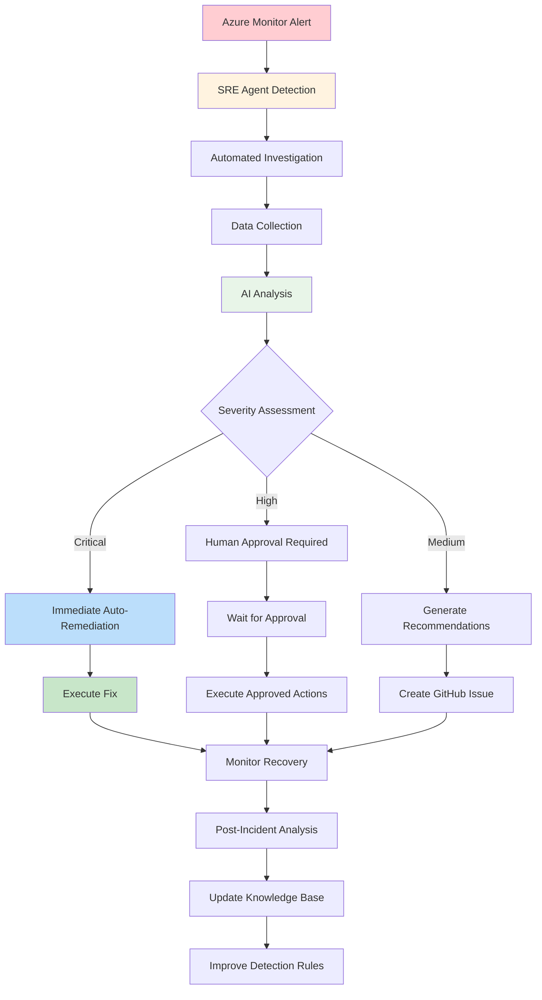

#  Complete Azure Observability Workshop Guide - Part 2
##  Beginner Workshop Modules 2-5

###  Continuing from Part 1
|  **Prerequisites** |  **Status** |  **Description** |
|----------------------|---------------|---------------------|
| **🏃 Application Running** | Required | Application running locally and sending telemetry to Application Insights |
| **☁️ Azure Resources** | Required | Resource Group, Log Analytics, Application Insights created |
| **🤖 GitHub Copilot** | Required | Active in VS Code for enhanced productivity |
| **📄 Configuration** | Required | Values saved in `workshop-config.txt` |
| **⏱️ Estimated Time** | 25 minutes | Complete dashboard and alerting setup |
| ** Skill Level** | Beginner | Basic Azure Portal navigation required |

---

##  Module 2: Creating Your First Dashboard and Alerts (25 minutes)

### 🤖 Automation Alternative: Pre-Built Dashboards

** Skip manual dashboard creation?** Our automation includes ready-to-use dashboards:

```bash
# Access pre-configured Grafana dashboards with sample data
cd resources/
./scripts/helpers/port-forward-grafana.sh

# Visit http://localhost:3000 (admin/ObservabilityWorkshop@2024!)
# Available dashboards:
# - Application Performance Overview
# - Infrastructure Monitoring
# - Business KPIs
# - Error Analysis Dashboard
# - SLO/SLI Tracking

# Generate sample traffic for realistic dashboard data
./scripts/helpers/generate-load.sh
```

**📚 Continue with manual creation below** to understand dashboard design principles.

###  2.1 Build Custom Dashboard in Azure Portal
**Time Required**: 15 minutes ( *or instant with pre-built dashboards*)

#### 📱 1. Access Application Insights Data
   - **Go to Azure Portal** (`portal.azure.com`)
   - **Navigate to your Application Insights resource**
   - **Click "Overview"** to see basic metrics
   - **Wait 5-10 minutes** if you don't see data yet (telemetry has some delay)

####  2. Explore Live Metrics
   - **Click "Live Metrics"** in the left menu
   - **Generate traffic** by running these commands in a new terminal:
   ```bash
   #  Traffic Generator - Live Metrics Demo
   # Purpose: Generate realistic traffic patterns for observing live metrics
   
   # Execute this command in a new terminal window
   for i in {1..50}; do
     # Make successful API calls
     curl -s http://localhost:5000/api/test > /dev/null     # Normal endpoint
     curl -s http://localhost:5000/api/slow > /dev/null     # Slow endpoint (500ms delay)
     curl -s http://localhost:5000/api/error > /dev/null    # Error endpoint (generates 500 errors)
     
     sleep 2  # Wait 2 seconds between iterations
     echo "Generated request batch $i/50"  # Progress indicator
   done
   
   #  Expected Results:
   # - Live Metrics will show incoming requests in real-time
   # - You'll see request rate, response times, and failure rate
   # - Different colored metrics for successful vs failed requests
   # - Performance counters will update live
   ```
   - **Observe**: Real-time request rates, response times, and failures

####  3. Create Custom Dashboard
   - **In Azure Portal, click "Dashboard"** (top menu)
   - **Click "New dashboard"**
   - **Name**: "Workshop Observability Dashboard"
   - **Click "Done customizing"**, then **"Edit"** to add tiles

####  4. Add Essential Monitoring Tiles

**Request Rate Tile**:
   - **Click "Add tile"** → **"Metrics"**
   - **Select your Application Insights resource**
   - **Configure**:
     ```
     Metric: Server requests
     Aggregation: Count
     Time range: Last 30 minutes
     Chart type: Line chart
     Title: "Request Rate"
     ```

**Response Time Tile**:
   - **Add another Metrics tile**
   - **Configure**:
     ```
     Metric: Server response time
     Aggregation: Average
     Time range: Last 30 minutes
     Chart type: Line chart
     Title: "Average Response Time"
     ```

**Failure Rate Tile**:
   - **Add another Metrics tile**
   - **Configure**:
     ```
     Metric: Failed requests
     Aggregation: Count
     Time range: Last 30 minutes
     Chart type: Column chart
     Title: "Failed Requests"
     ```

**Application Map Tile**:
   - **Click "Add tile"** → **"Application Insights"**
   - **Select "Application Map"**
   - **Choose your Application Insights resource**

5. **Add Custom KQL Query Tile**:
   - **Click "Add tile"** → **"Logs"**
   - **Select your Application Insights resource**
   - **Enter this KQL query**:
   ```kusto
   requests
   | where timestamp > ago(1h)
   | summarize RequestCount = count(), AvgDuration = avg(duration) by bin(timestamp, 5m)
   | render timechart
   ```
   - **Click "Run"** and then **"Pin to dashboard"**

6. **Save Dashboard**:
   - **Click "Save"**
   - **Share dashboard** with your team (optional)

** Checkpoint**: Your dashboard should show real-time metrics with multiple visualizations

### 2.2 Configure Intelligent Alerts
**Time Required**: 10 minutes

1. **Create Metric Alert for High Response Time**:
   - **Go to Application Insights** → **"Alerts"**
   - **Click "Create alert rule"**
   - **Configure Signal**:
     ```
     Signal name: Server response time
     Operator: Greater than
     Threshold value: 2000 (2 seconds)
     Aggregation granularity: 5 minutes
     Frequency of evaluation: 1 minute
     ```

2. **Create Action Group**:
   - **Click "Create action group"**
   - **Configure**:
     ```
     Action group name: Workshop-Alerts
     Short name: workshop
     Resource group: [your workshop resource group]
     ```
   - **Add Action**:
     ```
     Action type: Email/SMS/Push/Voice
     Name: Email Alert
     Email: [your email address]
     ```

3. **Complete Alert Rule**:
   - **Alert rule name**: "High Response Time Alert"
   - **Description**: "Triggered when average response time exceeds 2 seconds"
   - **Severity**: Warning (Sev 2)
   - **Enable upon creation**: Yes

4. **Create Smart Detection Alert**:
   - **Go to "Smart Detection"** in Application Insights
   - **Click "Smart detection settings"**
   - **Enable these detections**:
     - Failure Anomalies
     - Performance Anomalies
     - Memory Leak Detection
     - Security Detection

5. **Create Custom Log Alert**:
   - **Create new alert rule**
   - **Signal type**: "Custom log search"
   - **Search query**:
   ```kusto
   exceptions
   | where timestamp > ago(5m)
   | summarize count() by type
   | where count_ > 1
   ```
   - **Alert logic**:
     ```
     Based on: Number of results
     Operator: Greater than
     Threshold value: 0
     Frequency: 5 minutes
     Time period: 5 minutes
     ```

6. **Test Alert System**:
   ```bash
   # Generate errors to trigger alerts
   echo "Generating errors to test alerts..."
   for i in {1..20}; do
     curl -s http://localhost:5000/api/error
     sleep 1
   done
   
   # Generate slow requests
   echo "Generating slow requests..."
   for i in {1..10}; do
     curl -s http://localhost:5000/api/slow
     sleep 1
   done
   ```

** Checkpoint**: You should receive alert notifications within 5-10 minutes

---

## Module 3: AI-Assisted Troubleshooting with GitHub Copilot (30 minutes)

### 3.1 Setting Up GitHub Copilot for Monitoring Queries
**Time Required**: 10 minutes

1. **Create Monitoring Queries File**:
   ```bash
   # In your workshop project directory
   cd azure-monitoring-workshop
   mkdir monitoring-queries
   cd monitoring-queries
   ```

2. **Create KQL Query File in VS Code**:
   ```bash
   code monitoring-queries.kql
   ```

3. **Install KQL Extension in VS Code**:
   - **Press `Ctrl+Shift+X`** (Windows/Linux) or `Cmd+Shift+X`** (Mac)
   - **Search for**: "Kusto"
   - **Install**: "Kusto" by Microsoft

4. **Connect to Log Analytics Workspace**:
   - **Press `Ctrl+Shift+P`** and type "Kusto: Add Connection"
   - **Select**: "Application Insights"
   - **Enter your Application Insights connection details**
   - **Test connection**

** Checkpoint**: You should be able to execute KQL queries from VS Code

### 3.2 AI-Assisted Query Building with GitHub Copilot
**Time Required**: 20 minutes

1. **Basic Performance Analysis Query**:
   - **In `monitoring-queries.kql`, type this comment**:
   ```kql
   // Show all requests from the last hour with response times greater than 1 second, ordered by duration
   ```
   - **Wait for GitHub Copilot suggestion**
   - **Expected AI suggestion**:
   ```kql
   requests
   | where timestamp > ago(1h)
   | where duration > 1000  // duration is in milliseconds
   | project timestamp, name, url, duration, resultCode, success
   | order by duration desc
   ```
   - **Press Tab to accept**

2. **Error Analysis Query**:
   - **Add this comment**:
   ```kql
   // Find the most common exceptions in the last 24 hours, group by exception type and count them
   ```
   - **Expected AI suggestion**:
   ```kql
   exceptions
   | where timestamp > ago(24h)
   | summarize count() by type, outerMessage
   | order by count_ desc
   | take 10
   ```

3. **Performance Trend Analysis**:
   - **Add this comment**:
   ```kql
   // Analyze response time trends by hour for the last day, show average, min, max and request count
   ```
   - **Expected AI suggestion**:
   ```kql
   requests
   | where timestamp > ago(1d)
   | summarize 
       avg_duration = avg(duration),
       min_duration = min(duration),
       max_duration = max(duration),
       request_count = count()
       by bin(timestamp, 1h)
   | project timestamp, 
       avg_duration_seconds = avg_duration/1000,
       min_duration_seconds = min_duration/1000,
       max_duration_seconds = max_duration/1000,
       request_count
   | render timechart
   ```

4. **User Journey Analysis**:
   - **Add this comment**:
   ```kql
   // Track user sessions - show the most accessed API endpoints with success rates and performance
   ```
   - **Expected AI suggestion**:
   ```kql
   requests
   | where timestamp > ago(1d)
   | summarize 
       total_requests = count(),
       successful_requests = countif(success == true),
       avg_duration = avg(duration),
       p95_duration = percentile(duration, 95)
       by name
   | extend success_rate = round(100.0 * successful_requests / total_requests, 2)
   | project 
       endpoint = name,
       total_requests,
       success_rate,
       avg_duration_ms = round(avg_duration, 2),
       p95_duration_ms = round(p95_duration, 2)
   | order by total_requests desc
   ```

5. **Dependency Analysis Query**:
   - **Add this comment**:
   ```kql
   // Show external dependencies performance - analyze calls to external services and databases
   ```
   - **Expected AI suggestion**:
   ```kql
   dependencies
   | where timestamp > ago(1h)
   | summarize
       call_count = count(),
       avg_duration = avg(duration),
       success_rate = round(100.0 * countif(success == true) / count(), 2),
       failure_count = countif(success == false)
       by target, type
   | order by call_count desc
   ```

6. **Custom Business Metrics Query**:
   - **Add this comment**:
   ```kql
   // Create a health score dashboard - combine performance, errors, and availability metrics
   ```
   - **Expected AI suggestion**:
   ```kql
   let timeRange = 1h;
   let performance = requests
   | where timestamp > ago(timeRange)
   | summarize avg_response_time = avg(duration);
   let errors = requests
   | where timestamp > ago(timeRange)
   | summarize error_rate = round(100.0 * countif(success == false) / count(), 2);
   let availability = requests
   | where timestamp > ago(timeRange)
   | summarize total_requests = count(), successful_requests = countif(success == true)
   | extend availability_percent = round(100.0 * successful_requests / total_requests, 2);
   performance
   | extend error_rate = toscalar(errors)
   | extend availability = toscalar(availability)
   | extend health_score = case(
       avg_response_time < 1000 and error_rate < 1 and availability > 99, "Excellent",
       avg_response_time < 2000 and error_rate < 5 and availability > 95, "Good", 
       avg_response_time < 5000 and error_rate < 10 and availability > 90, "Fair",
       "Poor"
   )
   | project 
       avg_response_time_ms = round(avg_response_time, 2),
       error_rate_percent = error_rate,
       availability_percent = availability,
       health_score
   ```

7. **Test Your Queries**:
   - **Select each query** and run it using `Ctrl+Shift+E`
   - **Or copy to Azure Portal** → **Application Insights** → **Logs**
   - **Verify results make sense** with your test data

** Checkpoint**: All queries should execute successfully and return meaningful data

---

## Module 4: Implementing Proactive Monitoring (35 minutes)

### 4.1 Enhanced Health Check Implementation
**Time Required**: 15 minutes

1. **Create Enhanced Health Check Service**:
   
   Create `src/MonitoringApp/Services/HealthCheckService.cs`:
   ```csharp
   using Microsoft.Extensions.Diagnostics.HealthChecks;
   using System.Diagnostics;
   using System.Net.NetworkInformation;
   
   namespace MonitoringApp.Services
   {
       public class DatabaseHealthCheck : IHealthCheck
       {
           private readonly ILogger<DatabaseHealthCheck> _logger;
   
           public DatabaseHealthCheck(ILogger<DatabaseHealthCheck> logger)
           {
               _logger = logger;
           }
   
           public async Task<HealthCheckResult> CheckHealthAsync(
               HealthCheckContext context, 
               CancellationToken cancellationToken = default)
           {
               try
               {
                   // Simulate database connection check
                   await Task.Delay(Random.Shared.Next(50, 200), cancellationToken);
                   
                   var isHealthy = Random.Shared.NextDouble() > 0.1; // 90% success rate
                   
                   if (isHealthy)
                   {
                       return HealthCheckResult.Healthy("Database connection successful", 
                           new Dictionary<string, object>
                           {
                               ["server"] = "localhost",
                               ["database"] = "workshop_db",
                               ["response_time"] = "150ms"
                           });
                   }
                   
                   return HealthCheckResult.Unhealthy("Database connection failed",
                       data: new Dictionary<string, object>
                       {
                           ["error"] = "Connection timeout",
                           ["retry_count"] = 3
                       });
               }
               catch (Exception ex)
               {
                   _logger.LogError(ex, "Database health check failed");
                   return HealthCheckResult.Unhealthy("Database health check exception", ex);
               }
           }
       }
   
       public class ExternalApiHealthCheck : IHealthCheck
       {
           private readonly HttpClient _httpClient;
           private readonly ILogger<ExternalApiHealthCheck> _logger;
   
           public ExternalApiHealthCheck(HttpClient httpClient, ILogger<ExternalApiHealthCheck> logger)
           {
               _httpClient = httpClient;
               _logger = logger;
           }
   
           public async Task<HealthCheckResult> CheckHealthAsync(
               HealthCheckContext context, 
               CancellationToken cancellationToken = default)
           {
               try
               {
                   // Check external API (simulate with httpbin.org)
                   var stopwatch = Stopwatch.StartNew();
                   var response = await _httpClient.GetAsync("https://httpbin.org/status/200", cancellationToken);
                   stopwatch.Stop();
   
                   if (response.IsSuccessStatusCode && stopwatch.ElapsedMilliseconds < 5000)
                   {
                       return HealthCheckResult.Healthy("External API responsive",
                           new Dictionary<string, object>
                           {
                               ["endpoint"] = "https://httpbin.org",
                               ["response_time"] = $"{stopwatch.ElapsedMilliseconds}ms",
                               ["status_code"] = (int)response.StatusCode
                           });
                   }
   
                   return HealthCheckResult.Degraded("External API slow or unhealthy",
                       data: new Dictionary<string, object>
                       {
                           ["response_time"] = $"{stopwatch.ElapsedMilliseconds}ms",
                           ["status_code"] = (int)response.StatusCode
                       });
               }
               catch (Exception ex)
               {
                   _logger.LogError(ex, "External API health check failed");
                   return HealthCheckResult.Unhealthy("External API unreachable", ex);
               }
           }
       }
   
       public class MemoryHealthCheck : IHealthCheck
       {
           private readonly ILogger<MemoryHealthCheck> _logger;
   
           public MemoryHealthCheck(ILogger<MemoryHealthCheck> logger)
           {
               _logger = logger;
           }
   
           public Task<HealthCheckResult> CheckHealthAsync(
               HealthCheckContext context, 
               CancellationToken cancellationToken = default)
           {
               var process = Process.GetCurrentProcess();
               var workingSet = process.WorkingSet64;
               var privateMemory = process.PrivateMemorySize64;
               
               // Convert to MB
               var workingSetMB = workingSet / 1024 / 1024;
               var privateMemoryMB = privateMemory / 1024 / 1024;
   
               var data = new Dictionary<string, object>
               {
                   ["working_set_mb"] = workingSetMB,
                   ["private_memory_mb"] = privateMemoryMB,
                   ["gc_total_memory_mb"] = GC.GetTotalMemory(false) / 1024 / 1024,
                   ["gc_gen0_collections"] = GC.CollectionCount(0),
                   ["gc_gen1_collections"] = GC.CollectionCount(1),
                   ["gc_gen2_collections"] = GC.CollectionCount(2)
               };
   
               // Alert if memory usage is high
               if (workingSetMB > 500) // 500 MB threshold
               {
                   return Task.FromResult(HealthCheckResult.Degraded(
                       "High memory usage detected", data));
               }
   
               if (workingSetMB > 1000) // 1 GB threshold
               {
                   return Task.FromResult(HealthCheckResult.Unhealthy(
                       "Critical memory usage", data));
               }
   
               return Task.FromResult(HealthCheckResult.Healthy(
                   "Memory usage normal", data));
           }
       }
   }
   ```

2. **Update Program.cs with Enhanced Health Checks**:
   
   Replace the health checks section in `Program.cs`:
   ```csharp
   using MonitoringApp.Services;
   using Microsoft.AspNetCore.Diagnostics.HealthChecks;
   using Microsoft.Extensions.Diagnostics.HealthChecks;
   using System.Text.Json;
   
   // Add HTTP client for health checks
   builder.Services.AddHttpClient<ExternalApiHealthCheck>();
   
   // Configure enhanced health checks
   builder.Services.AddHealthChecks()
       .AddCheck<DatabaseHealthCheck>("database", tags: new[] { "ready", "database" })
       .AddCheck<ExternalApiHealthCheck>("external-api", tags: new[] { "external" })
       .AddCheck<MemoryHealthCheck>("memory", tags: new[] { "resource" })
       .AddCheck("self", () => HealthCheckResult.Healthy("Application is running"), tags: new[] { "ready" });
   
   // After app.Build(), replace health check endpoints:
   
   // Basic health check
   app.MapHealthChecks("/health");
   
   // Detailed health check with JSON response
   app.MapHealthChecks("/health/detailed", new HealthCheckOptions
   {
       ResponseWriter = WriteHealthCheckResponse,
       AllowCachingResponses = false
   });
   
   // Ready check (only essential services)
   app.MapHealthChecks("/health/ready", new HealthCheckOptions
   {
       Predicate = check => check.Tags.Contains("ready"),
       ResponseWriter = WriteHealthCheckResponse
   });
   
   // Live check (basic application status)
   app.MapHealthChecks("/health/live", new HealthCheckOptions
   {
       Predicate = _ => false, // Exclude all checks, just return that app is running
       ResponseWriter = WriteHealthCheckResponse
   });
   
   // Add this method at the end of Program.cs, before app.Run():
   static async Task WriteHealthCheckResponse(HttpContext context, HealthReport result)
   {
       context.Response.ContentType = "application/json";
       
       var response = new
       {
           status = result.Status.ToString(),
           timestamp = DateTime.UtcNow,
           duration = result.TotalDuration.TotalMilliseconds,
           checks = result.Entries.Select(x => new
           {
               name = x.Key,
               status = x.Value.Status.ToString(),
               description = x.Value.Description,
               duration = x.Value.Duration.TotalMilliseconds,
               data = x.Value.Data,
               exception = x.Value.Exception?.Message
           }).ToArray()
       };
   
       await context.Response.WriteAsync(JsonSerializer.Serialize(response, new JsonSerializerOptions
       {
           PropertyNamingPolicy = JsonNamingPolicy.CamelCase,
           WriteIndented = true
       }));
   }
   ```

3. **Test Enhanced Health Checks**:
   ```bash
   # Restart your application
   dotnet run
   
   # Test different health check endpoints
   curl http://localhost:5000/health | jq
   curl http://localhost:5000/health/detailed | jq
   curl http://localhost:5000/health/ready | jq
   curl http://localhost:5000/health/live | jq
   ```

** Checkpoint**: You should see detailed health information with multiple checks and rich metadata

### 4.2 Availability Monitoring Setup
**Time Required**: 10 minutes

1. **Deploy Application to Azure for External Monitoring**:
   ```bash
   # Create App Service plan
   az appservice plan create \
       --name "${APP_NAME}-plan" \
       --resource-group $RESOURCE_GROUP \
       --sku FREE \
       --is-linux
   
   # Create web app
   az webapp create \
       --name $APP_NAME \
       --resource-group $RESOURCE_GROUP \
       --plan "${APP_NAME}-plan" \
       --runtime "DOTNETCORE:8.0"
   
   # Configure Application Insights connection string
   az webapp config appsettings set \
       --name $APP_NAME \
       --resource-group $RESOURCE_GROUP \
       --settings "APPLICATIONINSIGHTS_CONNECTION_STRING=$CONNECTION_STRING"
   
   # Get the app URL
   APP_URL=$(az webapp show \
       --name $APP_NAME \
       --resource-group $RESOURCE_GROUP \
       --query defaultHostName \
       --output tsv)
   
   echo "App URL: https://$APP_URL"
   ```

2. **Deploy Application**:
   ```bash
   # Publish application
   dotnet publish -c Release -o ./publish
   
   # Create deployment package
   cd publish
   zip -r ../deploy.zip .
   cd ..
   
   # Deploy to Azure
   az webapp deployment source config-zip \
       --resource-group $RESOURCE_GROUP \
       --name $APP_NAME \
       --src deploy.zip
   
   # Wait for deployment and test
   sleep 30
   curl "https://$APP_URL/health/detailed"
   ```

3. **Create Availability Test in Azure**:
   - **Go to Application Insights in Azure Portal**
   - **Click "Availability"** in the left menu
   - **Click "Create test"**
   - **Configure Availability Test**:
     ```
     Test name: Workshop App Health Check
     URL: https://[your-app-url]/health/ready
     Test frequency: Every 5 minutes
     Test locations: Select 5 locations globally distributed
     Success criteria:
       - HTTP status code equals 200
       - Content contains: "Healthy"
     Alerts: Enable alerts
     ```

4. **Create Multi-Step Web Test** (Optional):
   - **Create new test**
   - **Test type**: "Multi-step web test"
   - **Upload web test file** or create simple steps:
     1. GET /health/live
     2. GET /api/test
     3. GET /health/detailed

** Checkpoint**: Your application should be accessible via Azure URL and availability tests should be running

### 4.3 Custom Metrics and Business KPIs
**Time Required**: 10 minutes

1. **Add Custom Metrics to Your Application**:
   
   Create `src/MonitoringApp/Services/MetricsService.cs`:
   ```csharp
   using Microsoft.ApplicationInsights;
   using Microsoft.ApplicationInsights.Metrics;
   using System.Diagnostics.Metrics;
   
   namespace MonitoringApp.Services
   {
       public class BusinessMetricsService
       {
           private readonly TelemetryClient _telemetryClient;
           private readonly ILogger<BusinessMetricsService> _logger;
           private readonly Meter _meter;
           
           // Custom metrics
           private readonly Counter<int> _orderProcessedCounter;
           private readonly Histogram<double> _orderValueHistogram;
           private readonly Counter<int> _userRegistrationCounter;
           private readonly Gauge<int> _activeUsersGauge;
   
           public BusinessMetricsService(TelemetryClient telemetryClient, ILogger<BusinessMetricsService> logger)
           {
               _telemetryClient = telemetryClient;
               _logger = logger;
               _meter = new Meter("WorkshopApp.Business");
   
               // Initialize custom metrics
               _orderProcessedCounter = _meter.CreateCounter<int>("business.orders.processed");
               _orderValueHistogram = _meter.CreateHistogram<double>("business.orders.value");
               _userRegistrationCounter = _meter.CreateCounter<int>("business.users.registered");
               _activeUsersGauge = _meter.CreateGauge<int>("business.users.active");
           }
   
           public void TrackOrderProcessed(decimal orderValue, string region = "unknown")
           {
               // Track with Application Insights
               _telemetryClient.GetMetric("Business.Orders.Processed").TrackValue(1);
               _telemetryClient.GetMetric("Business.Orders.Value").TrackValue((double)orderValue);
               
               // Track custom event with details
               _telemetryClient.TrackEvent("OrderProcessed", new Dictionary<string, string>
               {
                   ["Region"] = region,
                   ["OrderValue"] = orderValue.ToString(),
                   ["Currency"] = "USD"
               });
   
               // Track with OpenTelemetry metrics
               _orderProcessedCounter.Add(1, KeyValuePair.Create("region", region));
               _orderValueHistogram.Record((double)orderValue, KeyValuePair.Create("region", region));
   
               _logger.LogInformation("Order processed: ${OrderValue} in {Region}", orderValue, region);
           }
   
           public void TrackUserRegistration(string source = "direct")
           {
               _telemetryClient.GetMetric("Business.Users.Registered").TrackValue(1);
               _telemetryClient.TrackEvent("UserRegistered", new Dictionary<string, string>
               {
                   ["Source"] = source,
                   ["Timestamp"] = DateTime.UtcNow.ToString("O")
               });
   
               _userRegistrationCounter.Add(1, KeyValuePair.Create("source", source));
               _logger.LogInformation("User registered from {Source}", source);
           }
   
           public void UpdateActiveUsers(int count)
           {
               _telemetryClient.GetMetric("Business.Users.Active").TrackValue(count);
               _activeUsersGauge.Record(count);
           }
   
           public void TrackFeatureUsage(string featureName, string userId = "anonymous")
           {
               _telemetryClient.TrackEvent("FeatureUsed", new Dictionary<string, string>
               {
                   ["FeatureName"] = featureName,
                   ["UserId"] = userId,
                   ["Timestamp"] = DateTime.UtcNow.ToString("O")
               });
   
               _logger.LogInformation("Feature {FeatureName} used by {UserId}", featureName, userId);
           }
       }
   }
   ```

2. **Add Business Endpoints to Program.cs**:
   ```csharp
   // Register the service
   builder.Services.AddSingleton<BusinessMetricsService>();
   
   // Add these endpoints after the existing ones:
   
   app.MapPost("/api/orders", (BusinessMetricsService metrics) => {
       var orderValue = Random.Shared.Next(10, 500);
       var region = new[] { "North", "South", "East", "West" }[Random.Shared.Next(4)];
       
       metrics.TrackOrderProcessed(orderValue, region);
       
       return Results.Ok(new { 
           OrderId = Guid.NewGuid(), 
           Value = orderValue, 
           Region = region,
           Status = "Processed" 
       });
   });
   
   app.MapPost("/api/users/register", (BusinessMetricsService metrics) => {
       var source = new[] { "web", "mobile", "api", "referral" }[Random.Shared.Next(4)];
       
       metrics.TrackUserRegistration(source);
       
       return Results.Ok(new { 
           UserId = Guid.NewGuid(), 
           Source = source,
           Status = "Registered" 
       });
   });
   
   app.MapGet("/api/features/{featureName}", (string featureName, BusinessMetricsService metrics) => {
       var userId = $"user_{Random.Shared.Next(1, 1000)}";
       
       metrics.TrackFeatureUsage(featureName, userId);
       
       return Results.Ok(new { 
           Feature = featureName, 
           UserId = userId,
           Timestamp = DateTime.UtcNow 
       });
   });
   
   app.MapGet("/api/metrics/simulate", (BusinessMetricsService metrics) => {
       // Simulate business activity
       Task.Run(async () => {
           for (int i = 0; i < 10; i++)
           {
               metrics.TrackOrderProcessed(Random.Shared.Next(50, 200));
               await Task.Delay(1000);
           }
       });
       
       Task.Run(async () => {
           for (int i = 0; i < 5; i++)
           {
               metrics.TrackUserRegistration();
               await Task.Delay(2000);
           }
       });
       
       // Update active users count
       metrics.UpdateActiveUsers(Random.Shared.Next(100, 1000));
       
       return Results.Ok(new { Message = "Business metrics simulation started" });
   });
   ```

3. **Generate Business Metrics**:
   ```bash
   # Restart application
   dotnet run
   
   # Generate business activity
   curl -X POST http://localhost:5000/api/orders
   curl -X POST http://localhost:5000/api/users/register
   curl http://localhost:5000/api/features/checkout
   curl http://localhost:5000/api/features/search
   curl http://localhost:5000/api/metrics/simulate
   
   # Generate continuous business activity
   for i in {1..20}; do
     curl -X POST -s http://localhost:5000/api/orders > /dev/null
     curl -X POST -s http://localhost:5000/api/users/register > /dev/null
     curl -s "http://localhost:5000/api/features/feature$i" > /dev/null
     sleep 2
   done
   ```

4. **View Custom Metrics in Azure**:
   - **Go to Application Insights** → **Metrics**
   - **Select custom metrics**:
     - Business.Orders.Processed
     - Business.Orders.Value
     - Business.Users.Registered
   - **Create charts** with different aggregations (sum, count, average)

** Checkpoint**: Custom business metrics should appear in Application Insights within 5-10 minutes

---

## Module 5: Introduction to Azure SRE Agent (15 minutes)

### 5.1 Understanding Azure SRE Agent Capabilities
**Time Required**: 10 minutes

**Azure SRE Agent Overview**:
Azure SRE Agent represents the future of site reliability engineering, combining AI with operational expertise to create an intelligent system that:

- **Monitors 24/7** with contextual understanding of your applications
- **Automatically investigates incidents** using LLM reasoning capabilities
- **Implements self-healing** workflows with human approval checkpoints
- **Creates detailed GitHub issues** with root cause analysis
- **Learns from patterns** to prevent future incidents

### 🤖 SRE Agent Workflow Process



**Key Capabilities**:

1. **Continuous Health Monitoring**:
   - Real-time analysis of metrics, logs, and traces
   - Anomaly detection using AI pattern recognition
   - Proactive identification of degrading performance

2. **Automated Incident Response**:
   - Immediate response to Azure Monitor alerts
   - Intelligent triage based on severity and impact
   - Automated remediation actions (with approval workflows)

3. **Root Cause Analysis**:
   - LLM-powered investigation of incidents
   - Correlation of metrics, logs, and recent changes
   - Human-readable explanations of complex issues

4. **Integration with Development Workflow**:
   - Automatic GitHub issue creation
   - Detailed investigation reports
   - Recommended fixes and preventive measures

### 5.2 Simulating SRE Agent Workflows (Manual Implementation)
**Time Required**: 5 minutes

Since Azure SRE Agent is in preview, we'll create a simulation that demonstrates the concepts:

1. **Create SRE Agent Simulation**:
   
   Create `src/MonitoringApp/Services/SREAgentSimulation.cs`:
   ```csharp
   using Microsoft.ApplicationInsights;
   using System.Text.Json;
   
   namespace MonitoringApp.Services
   {
       public class SREAgentSimulation
       {
           private readonly TelemetryClient _telemetryClient;
           private readonly ILogger<SREAgentSimulation> _logger;
   
           public SREAgentSimulation(TelemetryClient telemetryClient, ILogger<SREAgentSimulation> logger)
           {
               _telemetryClient = telemetryClient;
               _logger = logger;
           }
   
           public async Task<IncidentResponse> SimulateIncidentResponse(string alertType, string severity)
           {
               var incidentId = $"INC-{DateTime.UtcNow:yyyyMMdd}-{Random.Shared.Next(1000, 9999)}";
               
               _logger.LogInformation("SRE Agent: Investigating incident {IncidentId} - {AlertType} ({Severity})", 
                   incidentId, alertType, severity);
   
               // Simulate investigation steps
               var investigation = new IncidentResponse
               {
                   IncidentId = incidentId,
                   AlertType = alertType,
                   Severity = severity,
                   StartTime = DateTime.UtcNow,
                   InvestigationSteps = new List<string>(),
                   Findings = new List<string>(),
                   RecommendedActions = new List<string>()
               };
   
               // Step 1: Gather recent metrics
               investigation.InvestigationSteps.Add("Analyzing recent performance metrics");
               await Task.Delay(1000); // Simulate analysis time
               
               switch (alertType.ToLower())
               {
                   case "high_response_time":
                       investigation.Findings.Add("Average response time increased by 300% in the last 10 minutes");
                       investigation.Findings.Add("CPU utilization is at 85% (normal: 40%)");
                       investigation.Findings.Add("Memory usage is at 78% (normal: 50%)");
                       investigation.RecommendedActions.Add("Scale out application instances");
                       investigation.RecommendedActions.Add("Investigate recent code deployments");
                       investigation.RecommendedActions.Add("Check database query performance");
                       break;
   
                   case "high_error_rate":
                       investigation.Findings.Add("Error rate increased from 0.1% to 15% in the last 5 minutes");
                       investigation.Findings.Add("Most errors are 500 Internal Server Error");
                       investigation.Findings.Add("Database connection pool exhaustion detected");
                       investigation.RecommendedActions.Add("Restart application instances");
                       investigation.RecommendedActions.Add("Increase database connection pool size");
                       investigation.RecommendedActions.Add("Implement circuit breaker pattern");
                       break;
   
                   case "dependency_failure":
                       investigation.Findings.Add("External API calls failing with timeout errors");
                       investigation.Findings.Add("95% of requests to payment service are failing");
                       investigation.Findings.Add("Network latency to external service increased by 500%");
                       investigation.RecommendedActions.Add("Enable circuit breaker for payment service");
                       investigation.RecommendedActions.Add("Switch to backup payment provider");
                       investigation.RecommendedActions.Add("Implement graceful degradation");
                       break;
               }
   
               // Step 2: Check recent deployments
               investigation.InvestigationSteps.Add("Checking recent deployments and configuration changes");
               await Task.Delay(500);
   
               // Step 3: Analyze error patterns
               investigation.InvestigationSteps.Add("Analyzing error patterns and user impact");
               await Task.Delay(500);
   
               investigation.EndTime = DateTime.UtcNow;
               investigation.Duration = investigation.EndTime - investigation.StartTime;
   
               // Generate GitHub issue content
               investigation.GitHubIssueContent = GenerateGitHubIssue(investigation);
   
               // Track the incident response
               _telemetryClient.TrackEvent("SREAgent.IncidentResponse", new Dictionary<string, string>
               {
                   ["IncidentId"] = incidentId,
                   ["AlertType"] = alertType,
                   ["Severity"] = severity,
                   ["Duration"] = investigation.Duration.TotalSeconds.ToString(),
                   ["FindingsCount"] = investigation.Findings.Count.ToString(),
                   ["ActionsCount"] = investigation.RecommendedActions.Count.ToString()
               });
   
               return investigation;
           }
   
           private string GenerateGitHubIssue(IncidentResponse investigation)
           {
               return $@"
   # 🚨 Incident Report: {investigation.AlertType}
   
   **Incident ID**: {investigation.IncidentId}  
   **Severity**: {investigation.Severity}  
   **Detection Time**: {investigation.StartTime:yyyy-MM-dd HH:mm:ss} UTC  
   **Investigation Duration**: {investigation.Duration.TotalMinutes:F1} minutes  
   **Status**: Under Investigation  
   
   ##  Automated Investigation Summary
   
   ### Investigation Steps Performed
   {string.Join("\n", investigation.InvestigationSteps.Select(step => $"-  {step}"))}
   
   ###  Key Findings
   {string.Join("\n", investigation.Findings.Select(finding => $"- 🔸 {finding}"))}
   
   ###  Recommended Actions
   {string.Join("\n", investigation.RecommendedActions.Select(action => $"-  {action}"))}
   
   ##  Next Steps
   - [ ] Review and validate SRE Agent findings
   - [ ] Implement recommended immediate actions
   - [ ] Monitor system recovery
   - [ ] Schedule post-incident review
   - [ ] Update runbooks based on learnings
   
   ##  Monitoring Links
   - [Application Insights Dashboard](https://portal.azure.com/#@/resource/subscriptions/.../insights)
   - [Live Metrics Stream](https://portal.azure.com/#@/resource/subscriptions/.../live)
   - [Alert Rules](https://portal.azure.com/#@/resource/subscriptions/.../alerts)
   
   ---
   *This issue was automatically created by Azure SRE Agent*  
   *Investigation completed in {investigation.Duration.TotalMinutes:F1} minutes*
   ";
           }
       }
   
       public class IncidentResponse
       {
           public string IncidentId { get; set; } = "";
           public string AlertType { get; set; } = "";
           public string Severity { get; set; } = "";
           public DateTime StartTime { get; set; }
           public DateTime EndTime { get; set; }
           public TimeSpan Duration { get; set; }
           public List<string> InvestigationSteps { get; set; } = new();
           public List<string> Findings { get; set; } = new();
           public List<string> RecommendedActions { get; set; } = new();
           public string GitHubIssueContent { get; set; } = "";
       }
   }
   ```

2. **Add SRE Agent Endpoint**:
   
   Add to `Program.cs`:
   ```csharp
   // Register SRE Agent simulation
   builder.Services.AddSingleton<SREAgentSimulation>();
   
   // Add SRE Agent simulation endpoints:
   app.MapPost("/api/sre/investigate", async (SREAgentSimulation sreAgent, 
       string alertType = "high_response_time", 
       string severity = "high") => 
   {
       var response = await sreAgent.SimulateIncidentResponse(alertType, severity);
       return Results.Ok(response);
   });
   
   app.MapGet("/api/sre/demo", async (SREAgentSimulation sreAgent) => 
   {
       var scenarios = new[]
       {
           ("high_response_time", "high"),
           ("high_error_rate", "critical"),
           ("dependency_failure", "medium")
       };
       
       var results = new List<object>();
       
       foreach (var (alertType, severity) in scenarios)
       {
           var response = await sreAgent.SimulateIncidentResponse(alertType, severity);
           results.Add(new 
           {
               IncidentId = response.IncidentId,
               AlertType = response.AlertType,
               Severity = response.Severity,
               Duration = response.Duration.TotalSeconds,
               FindingsCount = response.Findings.Count,
               ActionsCount = response.RecommendedActions.Count
           });
           
           await Task.Delay(1000); // Space out the simulations
       }
       
       return Results.Ok(new { Message = "SRE Agent demo completed", Results = results });
   });
   ```

3. **Test SRE Agent Simulation**:
   ```bash
   # Test individual incident investigation
   curl -X POST "http://localhost:5000/api/sre/investigate?alertType=high_response_time&severity=critical" | jq
   
   # Run demo of multiple scenarios
   curl http://localhost:5000/api/sre/demo | jq
   
   # Test different alert types
   curl -X POST "http://localhost:5000/api/sre/investigate?alertType=high_error_rate&severity=high" | jq
   curl -X POST "http://localhost:5000/api/sre/investigate?alertType=dependency_failure&severity=medium" | jq
   ```

** Checkpoint**: SRE Agent simulation should provide intelligent incident analysis and GitHub issue content

---

## Beginner Workshop Wrap-up (5 minutes)

### What You've Accomplished Today
 **Set up comprehensive Azure observability stack** with Application Insights and Log Analytics  
 **Created intelligent dashboards and alerts** with custom KQL queries  
 **Used AI assistance** for building monitoring queries with GitHub Copilot  
 **Implemented proactive health checks** with detailed status reporting  
 **Built custom business metrics** tracking for KPIs  
 **Deployed application to Azure** with availability monitoring  
 **Simulated Azure SRE Agent** workflows and incident response  

### Key Concepts Mastered
1. **Three Pillars of Observability**: Metrics, Logs, and Traces in practice
2. **Proactive vs Reactive Monitoring**: Prevention through health checks and business metrics
3. **AI-Assisted Operations**: Using GitHub Copilot for faster KQL query development
4. **Custom Metrics**: Tracking business-specific KPIs alongside technical metrics
5. **Intelligent Incident Response**: Understanding how AI can enhance SRE practices

### Business Value Achieved
- **Reduced Mean Time to Detection (MTTD)** through comprehensive monitoring
- **Faster troubleshooting** with AI-assisted query building
- **Improved application reliability** through detailed health checks
- **Business insight** through custom metrics tracking
- **Preparation for AI-enhanced operations** with SRE Agent concepts

### Ready for Intermediate Workshop?
You're ready for the **Intermediate Workshop (Part 3)** if you can:
-  Navigate Azure Monitor and Application Insights confidently
-  Write and modify KQL queries for log analysis
-  Create custom dashboards and configure intelligent alerts
-  Use GitHub Copilot effectively for monitoring query assistance
-  Understand the value of proactive monitoring and custom metrics
-  Appreciate how AI can enhance operational workflows

### Next Steps - Intermediate Workshop Preview
**Part 3 - Intermediate Workshop** will cover:
- **Advanced distributed tracing** across microservices architectures
- **Multi-cloud monitoring integration** with Datadog, Prometheus, and Grafana
- **CI/CD pipeline integration** with monitoring and automated rollback
- **Security monitoring** with Microsoft Defender and Sentinel
- **Enterprise-scale patterns** and best practices

### Homework Challenge (Optional)
Before the Intermediate Workshop, try to:
1. **Explore Application Insights features** you haven't used yet
2. **Create additional KQL queries** for your specific use cases
3. **Set up alerts** for your custom business metrics
4. **Think about observability needs** in your current projects
5. **Share your dashboard** with colleagues and get feedback

### Resources for Continued Learning
- **KQL Reference**: `docs.microsoft.com/en-us/azure/data-explorer/kusto/query/`
- **Application Insights Best Practices**: `docs.microsoft.com/en-us/azure/azure-monitor/app/`
- **GitHub Copilot for DevOps**: `docs.github.com/en/copilot`
- **Azure SRE Agent Documentation**: `docs.microsoft.com/en-us/azure/sre-agent` (coming soon)

---

**Continue to Part 3** for the Intermediate Workshop, or review any concepts from today's session that need reinforcement.

---

## 🔙 Navigation

**[⬅️ Back to Main README](../README.md)**